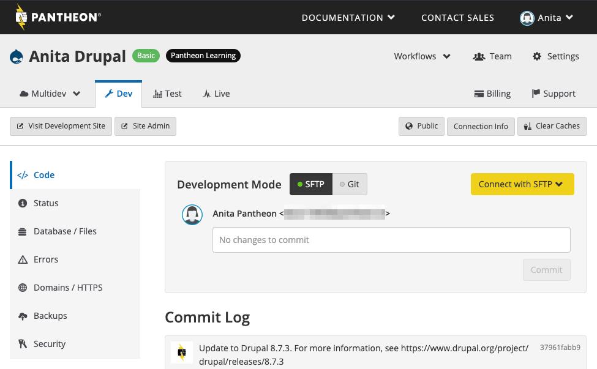

The Code tool within the Pantheon Dashboard on any environment allows you to interact with your site's code and review the commit log.

## Pantheon Git Repository
Your site's code repository includes your entire codebase, including core Drupal or WordPress, and any contributed modules, plugins, themes, installation profiles, libraries, etc. It does not include the `files/` directory (e.g. `sites/default/files` or `wp-content/uploads`) and should not contain any other static assets that you do not want tracked in version control.

### Drupal Code Structure

Drupal site code repositories are clones of one of our Drupal upstreams: [Drops-7](https://github.com/pantheon-systems/drops-7), or [Drops-8](https://github.com/pantheon-systems/drops-8), and consist of the following files and directories:

    ├── includes
    ├── index.php
    ├── misc
    ├── modules
    ├── profiles
    ├── scripts
    ├── sites
        └── all
           ├── modules
           └── themes
        └── default
           └── settings.php
    └── themes


<Alert title="Note" type="info">

The `sites/default/files` directory is represented in your code repository as a symbolic link to the Pantheon environment's `files/` directory.

</Alert>

### WordPress Code Structure

WordPress site code repositories are clones of one our [WordPress upstream](https://github.com/pantheon-systems/wordpress), and consist of the following files and directories:

```
├── index.php
├── wp-activate.php
├── wp-config.php
├── wp-comments-post.php
├── wp-blog-header.php
├── wp-admin
├── wp-cron.php
├── wp-load.php
├── wp-links-opml.php
├── wp-includes
├── xmlrpc.php
├── wp-trackback.php
├── wp-signup.php
├── wp-settings.php
├── wp-mail.php
├── wp-login.php
├── wp-content
    ├── index.php
    ├── mu-plugins
    ├── themes
    ├── plugins
```

<Alert title="Note" type="info">

The `wp-content/uploads` directory is represented in your code repository as a symbolic link to the Pantheon environment's `files/` directory.

</Alert>

## Managing Permissions
Permissions should be managed in the Dev environment via SFTP exclusively, as [Git only pays attention to the executable bit](https://git-scm.com/docs/user-manual.html).

## Navigate the Code Tool
You can set the site's connection mode to [git](/git/) or [SFTP](/sftp/) and access [connection information](/sftp#sftp-connection-information) from within the Dev environment's Code tool. This is also where all changes to the site's codebase (located in the `/code` directory) are committed.


You can also view the diff output for each individual file:


### Upstream Updates
The Dev environment provides [one-click updates](/core-updates/) for your site's upstream. Updates will appear in the Code tool once they are committed to the upstream repository.

  <dl>
  <Definition title="Upstream">
  A code repository that serves as a common package for your web application.
  </Definition>
  <Definition title="Repository">
  Centralized location of code intended for distribution.
  </Definition>
  </dl>

<Alert title="Note" type="info">

The Test and Live environments do not have write access to code outside of the deployment process.

</Alert>

## Develop
Get started by learning more about the [Pantheon workflow](/pantheon-workflow/) and [environment configuration](/read-environment-config/). Then, dive in to [developing directly with SFTP mode](/sftp/) and [explore more ways](/cms-admin/) of utilizing built-in admin tools.

### .gitignore
Pantheon provides default `.gitignore` files in the base of each site's code repository. It includes the path `sites/default/files` for Drupal sites, and `wp-contents/uploads` for WordPress sites. You can use this file to exclude directories from version control and backups.

## Optimize Performance
There are a lot of tools at your disposal when it comes to fine tuning dynamic sites. Resolve issues by [debugging slow performance](/debug-slow-performance/) and utilizing the [PHP slow log](/php-slow-log/).

Learn how to use [bots and indexing](/bots-and-indexing/) in a way that does not negatively impact performance. 

## Integrate 
You can also integrate with external Solr search indexes with services like [OpenSolr](/opensolr/) and [IndexDepot](/indexdepot/).

## See Also
- [Hot Fixes](/hotfixes/)
- [What is the "pantheon_api.module"](/modules#pantheon-module-drupal-7)
- [Email on Pantheon](/email/)
- [Platform and Custom Domains](/domains/)
- [SERVER_NAME and SERVER_PORT on Pantheon](/server_name-and-server_port/)
- [LDAP and LDAPS](/ldap-and-ldaps/)
- [Secure Integration](/secure-integration/)
- [SSO and Identity Federation on Pantheon](/sso/)
