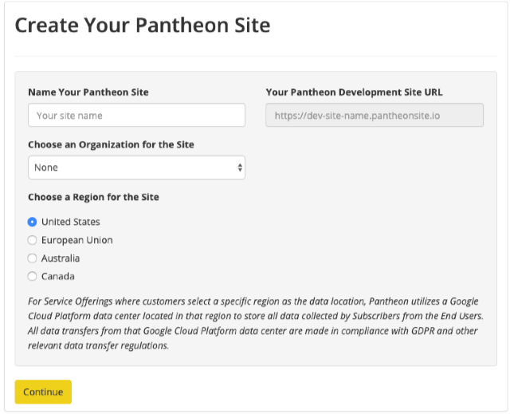

The Pantheon Dashboard provides a quick "click to install" method of creating new sites. In less than five minutes, you'll have a new site up and running on the platform.

## Create a Site

1.  From your User Dashboard, click **Create New Site**.
1.  Name your site.

  <Alert title="Note" type="info">

  The site name will be prefixed to all [Platform URLs](/domains/#platform-domains), which are automatically configured as subdomains of `pantheonsite.io`.

  </Alert>

1. If applicable, affiliate the site with an [organization](/organization-dashboard/#new-sites).
1. Click **Create Site**.
1. Choose a [Region](/regions/) for the Site.
1. Click **Continue** and wait a few moments for the Site to be created:

  

1. Select your [start state](/start-state). Install WordPress, Drupal 8, or Drupal 7 with one click. You can also select from any of the public or [Custom Upstreams](/custom-upstream) available on the platform.
1. Click **Visit your Pantheon Site Dashboard**.
1. Click **Visit Development Site** and complete the installation process for the selected framework.

  

## Sandbox Sites

Sandbox sites are useful for trying out the Pantheon platform, creating sandboxes for development, or for starting a new client project. A Sandbox has the equivalent resources of a Performance Small site. We allocate two Sandbox sites for all user accounts. If you've reached your limit of Sandbox sites, delete an unused site, take a site live or join an organization. If you're building sites for third parties, join the <ExternalLink link="https://pantheon.io/agencies/partner-program" text="Pantheon Partner Program"/> for more sandbox sites, Multidev environments, and other features. If you're at an educational institution, sign up for <ExternalLink text="Pantheon for EDU" link="https://pantheon.io/edu"/>.

## Your Pantheon Account
Your account is your own individual account, and every account can manage multiple projects or sites at a time. Pantheon doesn't recommend sharing your account with other people. If you're collaborating on a project or handing over ownership to a client, use our [team management](/team-management) and [ownership transfer](/site-owner-faq/#billing-tasks) tools.

## Frequently Asked Questions (FAQs)

### Can I rename my Pantheon site after creation?
No. Site names and Platform URLs are permanent and cannot be changed. As a workaround, you can export your existing site and import it to a new site with the correct name. See [Migrate Sites to Pantheon FAQs](/migrate/#how-do-i-clone-an-existing-pantheon-site).

### What if my site name is already taken?

Site names must be unique across all Pantheon sites, including [frozen](/platform-considerations/#inactive-site-freezing) sites. Choose another site name, and remember that the name you choose in the Pantheon Dashboard is only visible to the public in your [platform domain](/domains/#platform-domains).

## Next Steps
 - [Developing Directly with SFTP](/sftp/)
 - [Starting with Git](/git/)
