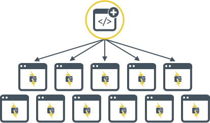

`youtube: https://youtu.be/b1lNrZL0xxM`

If you are a digital agency servicing clients, or a reseller of Pantheon as part of a managed solution, visit the [Partner Program Page](https://pantheon.io/agencies/partner-program) to learn more about getting Custom Upstreams and some of the other benefits of becoming a Pantheon Partner.

<Callout title="Accelerate Your Workflow" link="https://pantheon.io/agencies/learn-pantheon?docs">

Improve your agency's development efficiency with custom DevOps training from Pantheon experts.

</Callout>

For corporate or higher education customers, Custom Upstreams is included for [Pantheon Enterprise](https://pantheon.io/pantheon-enterprise) with Gold Support and higher, and all [Pantheon EDU](https://pantheon.io/edu) accounts. You can learn more by reaching out to our accounts team using the forms on the pages linked here.

<Alert title="Note" type="info">

Support for Custom Upstreams requires that the externally hosted upstream repository is connected properly to the platform. For details, see [Get Support](/support/#custom-upstreams). If you are considering a Composer based workflow, refer to [Composer Fundamentals and Workflows](/composer/).

</Alert>

## Benefits

### Standardize Design and Functionality Across Many Sites
Custom Upstreams act as a scaffold for new sites, allowing developers and site owners of any skill level to kickoff projects at warp speed.

Instead of repeating the same technical work on each individual site, you can build and maintain a common user interface with unified branding and functionality once, in a single source.

> Learn how the web team at Weill Cornell Medical College used Custom Upstreams to rescue 100+ websites from design anarchy in [this case study](https://pantheon.io/resources/weill-cornell-drupal-distribution-case-study).

### Efficient Update Strategy
Not only does this workflow free up developer time, it establishes a sustainable and scalable process for handling updates across massive site portfolios.

New features and functionality can be continuously developed in the Custom Upstream repository, then distributed to each site, where they can be applied with a single click by site owners.

> See how Forum One uses this process to build, launch, and manage nearly 200 satellite sites for Fairfax County Public Schools in [this case study](https://pantheon.io/resources/forum-one-pantheon-fairfax-county-public-schools-drupal-case-study).

### Scale Client Services
Spend less time doing non-core activities and reclaim lost billable hours where it counts most. Custom Upstreams help improve support efficiency by empowering non-technical clients and junior developers to handle lower-level support issues, such as creating a new site or applying updates. This gives advanced developers more time to focus on higher-level support work and new features.

> Hear from Kalamuna how this process liberates developers and empowers newbies to provide ridiculously awesome support in [this case study](https://pantheon.io/resources/kalamuna-pantheon-drupal-agency-case-study).

## Workflow Overview
There are three levels of repositories in play here, and updates flow "downstream" from one level to another.

<ul class="upstream" style="margin-right:40px;display:inline-flex;">
<li>Core Updates</li>
</ul>

<h3>Level 1: Pantheon's Core Upstream</h3>
The top level repository will be one of Pantheon's core upstreams (either [WordPress](https://github.com/pantheon-systems/wordpress), [Drupal 8](https://github.com/pantheon-systems/drops-8), or [Drupal 7](https://github.com/pantheon-systems/drops-7)). Core upstream updates are distributed by Pantheon and must be applied downstream.

<ul class="upstream">
<li>Parent Theme</li>
<li>Common plugins / Contrib modules</li>
</ul>

<h3>Level 2: Your Custom Upstream</h3>
The second level repository is a Custom Upstream, where core updates from Pantheon are pulled in and modifications to your common codebase are distributed (e.g. parent theme and plugin/module version updates).

The Custom Upstream repository is hosted outside of Pantheon using a provider like [GitHub](https://github.com/), [Bitbucket](https://bitbucket.org/) or [GitLab](https://about.gitlab.com/) <a rel="popover" data-proofer-ignore data-toggle="tooltip" data-html="true" data-title="" data-content="Contact support to create a GitLab based custom upstream."><em class="fa fa-info-circle"></em></a>. It's connected to Pantheon and associated with your organization, allowing fellow team members the option to select this repository as a starting point when creating new sites.

<ul class="upstream">
<li>Child Theme</li>
<li>Site-specific plugins / Custom code</li>
</ul>

<h3>Level 3: Site Repository</h3>
Finally, core updates and changes to the common codebase make their way down to the site repository for each site that uses the Custom Upstream.

The site repository allows separation between common code across all sites, tracked in the Custom Upstream, and site specific customizations, tracked in each individual site and facilitates rolling out updates quickly and easily.

## Terminology
Here are definitions for commonly used terms:

* **Upstream**: A repository that acts as a parent for another repository, like [Pantheon's WordPress Upstream](https://github.com/pantheon-systems/wordpress). The next two definitions are specific types of Upstreams.
* **Custom Upstream**: A repository restricted to members of an organization, containing a common codebase for new sites. This type of repository is a child repository to Pantheon's core upstreams ([WordPress](https://github.com/pantheon-systems/wordpress), [Drupal 8](https://github.com/pantheon-systems/drops-8), [Drupal 7](https://github.com/pantheon-systems/drops-7)) and acts as a parent for site level repositories.
* **Public Upstream**: A repository that is open to all Pantheon users which contains a common codebase for new sites, like [Panopoly](https://github.com/populist/panopoly-drops-7).
* **Repository**: A collection of files packaged in a single directory under version control.
* **Remote Repository**: A central version control location, e.g. residing on GitHub or Bitbucket.
* **Upstream Updates**: Code changes that are made once in a parent (upstream) repository, then applied "downstream" to child repositories. This is how Pantheon's one-click updates work.
* **Site Repository**: Child repository where upstream updates are applied and site specific customizations are tracked, like your site's codebase on Pantheon.

## Next Steps

Once you've grasped the concepts discussed above, you're ready to create your own Custom Upstream.

- [Create a Custom Upstream](/create-custom-upstream)
