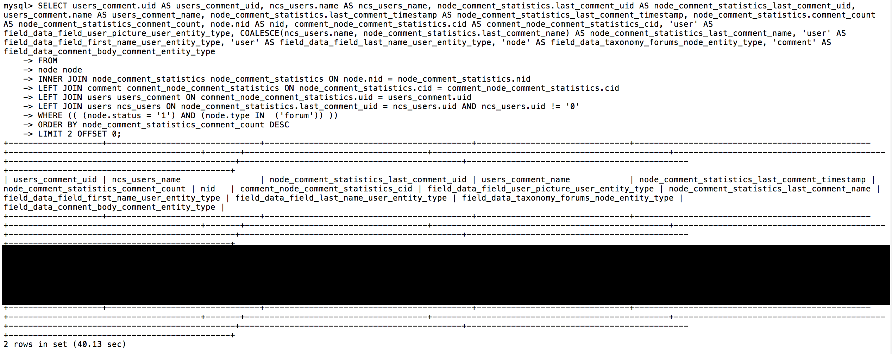
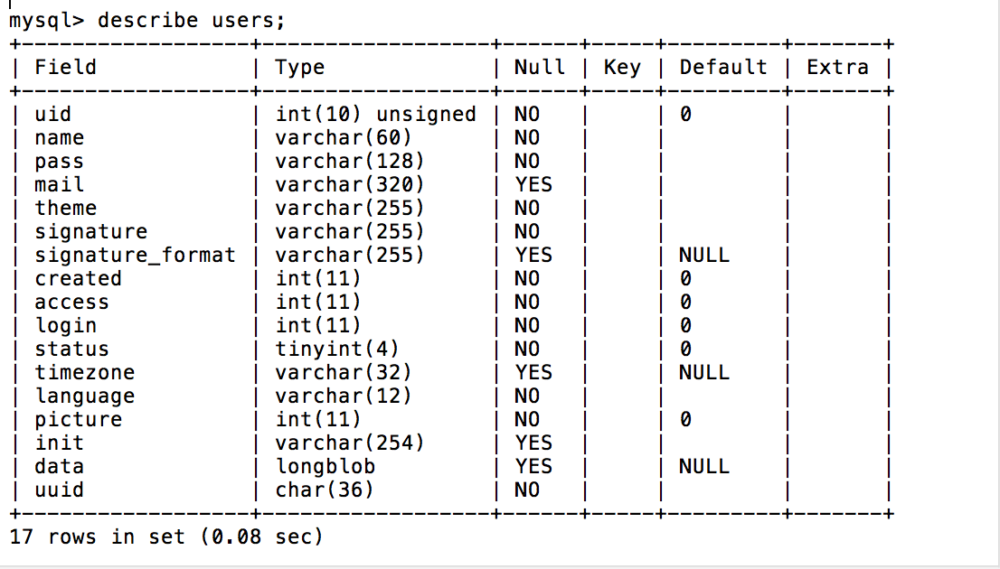
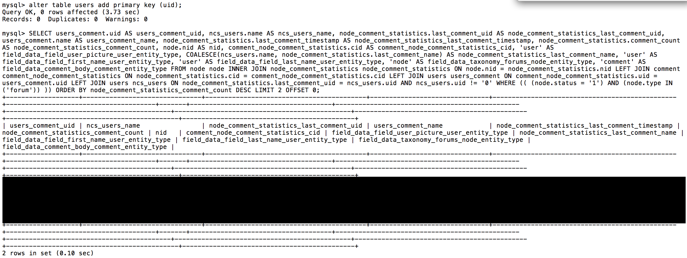

While going through MySQL and PHP slow logs is a great way to find issues, modern reporting services that are integrated with your site help speed the process up tremendously. There are a few different systems to choose from, but at Pantheon we use [New Relic Pro](/docs/new-relic). This article explains how you can troubleshoot MySQL databases with New Relic Pro. 

## Open New Relic Pro

From within Pantheon, go to the Dashboard for the site you suspect is having problems with MySQL query performance. Select the environment: Dev, Test, or Live. Click the **New Relic** tab, and select **Go to New Relic**.

## Investigate Activity

1. Open New Relic, click **Applications**, and select the application the issue has been reported on (Dev/Test/Live).
2. Using the graph, locate the time period the issue occurred in. This is usually visually apparent via large spikes in the graph. If not, use the New Relic time period selection tool to broaden your search (30 min, 60 min, 3 hours, etc.) until you find the problem.  
3. Highlight the spike in activity you want to investigate. New Relic will reload the page with the time frame you've selected.  
4. Click **Transactions**. The default sort is "Most Time Consuming" but this can be a false positive, as it measures a sum of time loading specific transactions, not the time per individual transaction. If a particular item is called 10x more than another, but loads quickly, it's **sum** will send it to the top of the list even if it's behaving well. Choose "Slowest average result time" instead. This will resort the order, bringing the biggest speed (or lack thereof) offenders to the fore.

### Drupal Sites
At times, systems like Drupal's Watchdog appear at the top. In general, that's an indication of a MySQL database under duress. Look for complex entities, such as Panels and Views, or custom functionality that's specific to the site in question. 

## Review Log Entries
1. Click on the most likely subject to see the details of that transaction. Scroll down, and note the transaction traces.  
2. Select the worst transaction trace to see a complete stack trace of that particular transaction.
3. Get a more detailed breakdown by clicking on **SQL statements**. Scroll down until you find something suspicious.
4. Once located, you can see how and where it's happening by finding the path near the bottom of the page.    
5. The New Relic Pro trace does not give the full query; it only shows the query with placeholders, which cannot be executed against MySQL as is. To do that, you'll need to look in the MySQL slow log. Go back to the site's panel on the Dashboard and get the SFTP connection information. Modify it per [this article](/docs/mysql-access#frequently-asked-questions) to connect to MySQL via SFTP through your terminal or an FTP program that supports the SFTP protocol.

### Review the Slow Log
[Download database log files](/docs/logs/#database-log-files) and review the `mysql-slow-query.log` file. Search for the query within the log. If it isn't there, download and unzip any applicable archived slow logs (e.g. `mysqld-slow-query.log-20160606`) and search there. The archived slow logs are created by date and time, so look for the one that corresponds with the trace you are working with.

Using the information from the New Relic trace, find the full query in the slow log. First, choose a distinctive part of the query. In this case I used "grep -c users\_comment.uis AS users\_comment\_uid" to get a count of the number of times that field has been included in the slow log. If the log is small enough (or if you have enough RAM), you can load it into your favorite text editor or IDE instead.  
 ​  
Close out the SFTP session and get the MySQL CLI information for the Test MySQL server. If the Test server has major differences from your Live server, you can either connect to Live (not recommended) or clone your Live database to your Dev or Test environment via your Pantheon Dashboard. Once this is done, connect to the MySQL server of your choice and run the query.  
 
If the result confirm your suspicions, as this one does, delve in deeper to find out why the query is behaving so badly. Type [EXPLAIN](https://dev.mysql.com/doc/refman/5.7/en/explain.html) and then re-paste the query. MySQL will display extended information on how it’s [executing the query](https://dev.mysql.com/doc/refman/5.7/en/using-explain.html). Look for really odd things. For example, this one really doesn't look that bad, except the users table is referenced twice via alias and there isn't a single key index being used to search them.
 
Looking at that table with a MySQL `describe` command shows that there is no primary key set on the UID field.  
 
Now that the problem has been found, it can be addressed. In this case, simply adding in the primary key and re-running the query gets a much improved query performance of 0.10 seconds.  
 
**To recap:**

1. Use New Relic Pro to narrow and identify periods of time that have high load and/or slow response times.
2. Narrow down the scope to one of those time periods and find the worst performing transactions.
3. Within those transactions, go into the SQL trace to discover long running queries.
4. Using SFTP, download the appropriate MySQL Slow Log to retrieve the query in its entirety.
5. Connect to a safe MySQL server via CLI. Run the query to test the performance.
6. If the query result is poor, use the `EXPLAIN` and `EXPLAIN EXTENDED` MySQL command to get additional information. You can also examine the MySQL tables for structural issues using `DESCRIBE` and `ANALYZE` commands.
7. Once identified, fix the issue. This can be within the MySQL server itself if that's where the problem is, or it can be within the application by redoing code or configurations that are creating the errant query.
 
