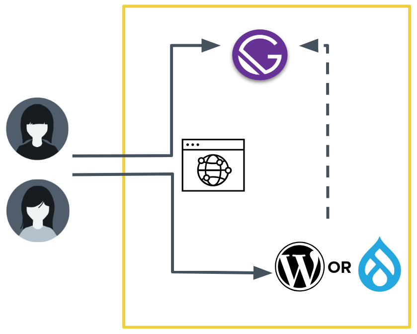

<dfn id="decoupled">Decoupled Architecture</dfn> is a site architecture that combines the speed and agility of static sites with the editing ease of standard-model content management systems. Web teams can use tools and frameworks specialized to their areas of expertise; Front-end Developers can used modern JavaScript-centric frameworks and libraries rather than the theming systems of older, monolithic LAMP stack systems like WordPress and Drupal.

<Alert title="Feature Preview" type="info">

This page refers to products and features which are currently in development or early access. The content on this page is subject to change as development continues, so check back frequently to learn the latest developments.

</Alert>

## Pantheon's Decoupled Architecture

Pantheon is enabling developers and agencies to easily create and manage decoupled sites from a single platform, by providing two new features: Decoupled Bridge and Edge Sites.

<Enablement link="https://pantheon.io/decoupled-cms?docs" title="Sign up for updates!">

Sign up for Edge Sites updates, or talk to sales about early access for Decoupled Bridge. Click the link above to get started!

</Enablement>

### Decoupled Bridge

**Decoupled Bridge** is a product for running a [Node.js](https://nodejs.org/) codebase in parallel with a WordPress or Drupal site.
It serves a use case where a domain's public traffic is delivered from a Server-Side Rendered front-end framework such as [Frontity](https://frontity.org/), [Next.js](https://nextjs.org/), or [Nuxt.js](https://nuxtjs.org/) and administrative content editing is done in a WordPress or Drupal interface.

Decoupled Bridge is presently in an Early Access phase where we are engaging with a small set of customers via our [Professional Services](/professional-services) team.
Each Decoupled Bridge site requires connecting continuous integration and infrastructure tooling to a GitHub repository.

We recommend, but do not require, that those repository be structured as "monorepos" with back-end CMS code and front-end framework code managed together.
The monorepo structure allows for easier synchronization of changes that affect the back-end and front-end sides together.

### Edge Sites

**Edge Sites** is a forthcoming product for running websites built to run on a CDN.
Edge Sites takes the result a Node.js static site generator process and deploys it to the edge of our Global CDN.

Edge Sites will be optimized for popular SSG frameworks like Gatsby.
A finalized list of supported frameworks will be developed by working with customer sites during Early Access, and Limited Availability phases.

[Sign up for email updates to hear the latest on Edge Sites development](https://pantheon.io/decoupled-cms?docs).

## FAQ

### What Content Management Systems will Decoupled Bridge and Edge Sites support?

WordPress and Drupal are still the CMSs of choice at Pantheon, and are the only data source available for these products.

### What Git providers will Decoupled Bridge and Edge Sites support?

Both products are being developed with GitHub as the location of source repositories.
During Early Access and Limited Availability we will evaluate which other providers our customers need to integrate with.

## See Also

- [The Five Ws of Decoupled Websites](https://2020.wpcampus.org/schedule/the-five-ws-of-decoupled-websites/)
- [How Decoupled Architectures Can Benefit the Entire Web Team, and Drive User Engagement](https://pantheon.io/blog/decoupled-architectures-can-benefit-every-member-of-web-team)
- [Drupal: Sometimes Headless, Never Heartless](https://pantheon.io/blog/drupal-sometimes-headless-never-heartless)
