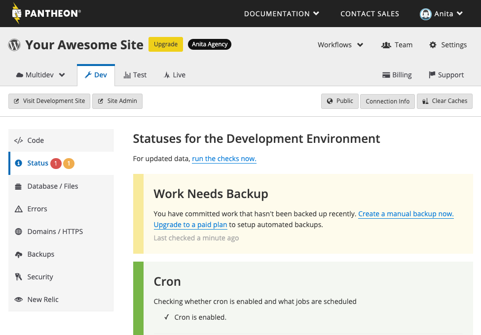

Pantheon provides static site analysis as a service for Drupal sites to make best practice recommendations on site configurations. These reports are found in the Site Dashboard under the **Status** tab and are accessible by site team members.



Every site is unique, with its own individual configuration, content, audience, and so forth. On Pantheon, they're all built with one of two CMS frameworks, Drupal or WordPress, and have the same architectural requirements. Therefore, it's possible to provide recommendations that fit the vast majority of use cases using a technique known as **static program analysis** by gathering performance and behavior patterns to see how a site works.

This mechanism does not actually perform requests on your site, and in doing so avoids the observer effect. It's non-intrusive, so no installation or configuration is required. Finally, it's completely automated for consistent reports and results.

In short, you get a fast, repeatable report that can help detect common problems and provide insights into your site.

## What Does Launch Check Evaluate?

- Drupal caching settings for optimal settings that will leverage both internal and reverse proxy caches
- Modules, including duplicate modules in the codebase, missing modules which damage performance, development modules in live environments and unrecommended modules with compatibility problems
- Views caching for each view display, both result and query caching
- Watchdog logs, including overall count, 404 entries, PHP errors
- Drupal site status report
- Users, including reports on number of users, roles, etc.

## What Doesn't Launch Check Address?

- DOM and frontend performance - browsers and aggregating tools such as [New Relic Pro](/new-relic) are in a much better position to analyze and report
- Usability and site experience - in part, subjective and highly individualized to the site, not really something that can be quantified
- Aesthetics - similarly, way out of scope
- Content - can count the quantity and size, but we leave the actual content to the stakeholders

## How Does it Work?

To generate the reports, Pantheon uses [Site Audit](https://drupal.org/project/site_audit), an open-source collection of Drush commands. Site Audit is developed and maintained by Pantheon, but is not limited to the Pantheon platform. Any Pantheon specific support is wrapped in a vendor option.

## Frequently Asked Questions

### Deprecated Configuration for the Temporary Files Path Warning on Drupal 8.8.0
The release of Drupal 8.8.0 introduced a change in the temporary files path, which prompts the following warning:

```
You are using deprecated configuration for the temporary files path. Remove the configuration and add the following to settings.php. $settings["file_temp_path"] = "/srv/bindings/.../tmp"
```

You can safely ignore this warning.

### Trusted Host Setting for Drupal 8
A warning within `/admin/reports/status` will appear when the `trusted_host_patterns` setting is not configured. This setting protects sites from HTTP Host header attacks. However, sites running on Pantheon are not vulnerable to this specific attack and the warning can be safely ignored. For more details, see [Configuring settings.php](/settings-php/#trusted-host-setting).

### Why does site audit have more reports than what's shown in the Dashboard?

The Dashboard integration is intended to provide developers with the most actionable items; some reports are purely informational and have been omitted. Additionally, some reports are more system intensive, so it makes more sense to allow them to be run on-demand, rather than automatically.

### How can I manually run site audit on my site?

You can also execute a full report encoded in JSON format to your terminal:

```bash
terminus remote:drush <site>.<env> -- aa --skip=insights --detail --vendor=pantheon
```

### Are there plans to support Drupal 6 sites?
At this time, there are no plans to support Drupal 6 with this tool.

### Can I opt out of a specific recommendation?

If you want to permanently opt out of a check, you can set configuration options in `settings.php`. Individual check names can be specified with a combination of the report name and check name. Note that the configuration array is `$conf` in Drupal 7 and `$config` in Drupal 8.

#### Examples
Drupal 7 — permanently opt out of the PageCompression check in the Cache report:

```php
$conf['site_audit']['opt_out']['CachePageCompression'] = TRUE;
```

Drupal 8 — permanently opt out of the check for Development modules:

```php
$config['site_audit']['opt_out']['ExtensionsDev'] = TRUE;
```

The specific key you'll use in the `$conf` or `$config` array is a combination of the report and the check. You can find a list of checks for the report here: [Site Audit Checks D7](http://cgit.drupalcode.org/site_audit/tree/Check?h=7.x-1.x) | [Site Audit Checks D8](http://cgit.drupalcode.org/site_audit/tree/Check?h=8.x-2.x).

Keep in mind that the site audit is executed via Drush so it's best to use the [`$_ENV` superglobal](/read-environment-config/) for doing things like limiting the exclusions to one environment.

### I want to contribute/I found a mistake. How should I proceed?

Use the [Site Audit Issue Queue](https://drupal.org/project/issues/site_audit) to add and request features, or to report inaccuracies.

## Troubleshooting

### Site Audit Isn't Running on My Site

If your site's Launch Check is showing recent update information about Database or Redis usage, but older information for the Site Audit checks, and clicking "run the checks now" doesn't update the status, there may be an application error interrupting its complete operation. In order to debug what might be causing an error, you can run the [Terminus](/terminus/) command to execute Site Audit directly on your Pantheon site:

```bash
terminus drush <site>.<env> -- aa --skip=insights --detail --vendor=pantheon --strict=0
```

If Site Audit isn't running, there may be a fatal PHP error in your application; debugging these problems are crucial for your site's continuing operation and performance.

## See Also
If you have a WordPress site, see [Launch Check - WordPress Performance and Configuration Analysis](/wordpress-launch-check).
