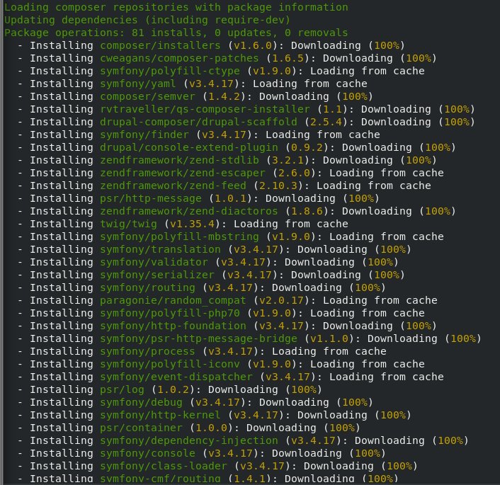
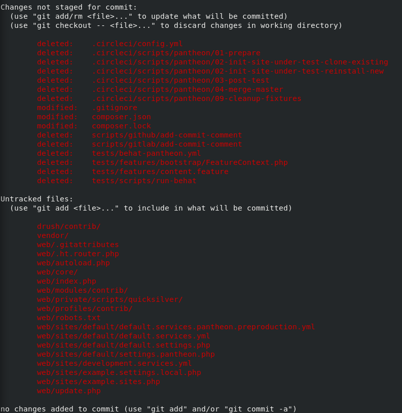

In this guide, we’re going to run through the bare necessities to use [Composer](https://getcomposer.org/) for managing a Drupal 8 site on your local machine and pushing to Pantheon.

Using a Composer managed site **removes** the ability to [apply Drupal core updates via the site dashboard](/core-updates/).  This is for advanced users who are comfortable taking complete responsibility for the management of site updates with Composer.

<Alert title="Note" type="info">

As packages pulled by Composer are updated (along with their dependencies), version compatibility issues can pop up. Sometimes you may need to manually alter the version constraints on a given package within the `require` or `require-dev` section of `composer.json` in order to update packages. See the [updating dependencies](https://getcomposer.org/doc/01-basic-usage.md#updating-dependencies-to-their-latest-versions) section of Composer's documentation for more information.

As a first troubleshooting step, try running `composer update` to bring `composer.lock` up to date with the latest available packages (as constrained by the version requirements in `composer.json`).

</Alert>

## Creating the Pantheon Site

To begin, we’ll want to start a brand new Drupal 8 site on Pantheon from our empty upstream. This upstream is different from the Drupal 8 upstream in that it does not come with any Drupal files. As such, you must use Composer to download Drupal.

Before we begin choose a machine-friendly site name. It should be all lower case with dashes instead of spaces. I'll use `d8-composer-no-ci` but choose your own. Once you have a site name export it to a variable for re-use.

```bash
export PANTHEON_SITE_NAME="d8-composer-no-ci"
```

You should also be authenticated with Terminus. See the [Authenticate into Terminus](/machine-tokens/#authenticate-into-terminus) section of the [machine tokens documentation](/machine-tokens) for details.

Create a new Pantheon site with an empty upstream.

```bash
terminus site:create $PANTHEON_SITE_NAME 'My D8 Composer Site' empty
```

**Note** you can also add the `--org` argument to `terminus site:create` if you would like the site to be part of an organization. See `terminus site:create -h` for details and help.

## Cloning example-drops-8-composer Locally

Instead of setting up `composer.json` manually, it is easier to start with the [`example-drops-8-composer`](https://github.com/pantheon-systems/example-drops-8-composer) repository.

1. Clone the `example-drops-8-composer` repository locally:

  ```bash
  git clone git@github.com:pantheon-systems/example-drops-8-composer.git $PANTHEON_SITE_NAME
  ```

   This command assumes you have [SSH keys](/ssh-keys/) added to your GitHub account. If you don't, you can clone the repository over HTTPS:

  ```bash
  git clone https://github.com/pantheon-systems/example-drops-8-composer.git $PANTHEON_SITE_NAME
  ```

2. `cd` into the cloned directory:

  ```bash
  cd $PANTHEON_SITE_NAME
  ```

## Updating the Git Remote URL

1. Store the Git URL for the Pantheon site created earlier in a variable:

  ```bash
  export PANTHEON_SITE_GIT_URL="$(terminus connection:info $PANTHEON_SITE_NAME.dev --field=git_url)"
  ```

2. Update the Git remote to use the Pantheon site Git URL returned rather than the `example-drops-8-composer` GitHub URL:

  ```bash
  git remote set-url origin $PANTHEON_SITE_GIT_URL
  ```

## Removing Automation Pieces

`example-drops-8-composer` was designed to run automated tests on a continuous integration server. Unless you plan on running automated tests it is safe to completely remove the automated testing functionality.

1.  Delete the following directories and files:
    - `scripts/github`
    - `scripts/gitlab`
    - `.circleci`
    - `.ci`
    - `tests`
    - `bitbucket-pipelines.yml`
    - `build-providers.json`
    - `gitlab-ci.yml`

1.  Modify `composer.json`:
    - Remove all dependencies in the `require-dev` section.
    - Update the `scripts` section to remove the `lint`, `code-sniff`, and `unit-test` lines.

1.  Remove the following section from `pantheon.yml`:

    ```yml
    workflows:
      sync_code:
        after:
          - type: webphp
            description: Push changes back to GitHub if needed
            script: private/scripts/quicksilver/quicksilver-pushback/push-back-to-github.php
    ```
        

## Managing Drupal with Composer

<Alert title="Note" type="info">

When possible, use tagged versions of Composer packages. Untagged versions will include `.git` directories, and the [Pantheon platform is not compatible with git submodules](/git-faq/#does-pantheon-support-git-submodules). If you remove the `.git` directories, be sure to put them back again after you push your commit up to Pantheon (see instructions below). To do this, remove the vendor directory and run `composer install`.

</Alert>

### Downloading Drupal Dependencies with Composer

Normally the next step would go through the standard Drupal installation. But since we’re using Composer, none of the core files exist yet. Let’s use Composer to download Drupal core.

1. Since we modified `composer.json` we will need to update Composer. This will also download the defined dependencies:

    ```bash
    composer update
    ```

    Downloading Drupal core and its dependencies for the first time may take a while. Subsequent updates should take less time.

    

2. And now we need to install:

    ```bash
    composer install
    ```

3. Let's take a look at the changes:

    ```bash
   git status
   ```

   It appears that our web directory isn't being committed. This is because the `example-drops-8-composer` `.gitignore` file assumes that you’re using a build step with continuous integration.

4. To make it compatible with this manual method, you need to edit the `.gitignore` file and remove everything above the `:: cut ::` section.

   **Important:** Without this modification, critical components such as Drupal core and contrib modules will be ignored and not pushed to Pantheon.

5. Now let’s run `git status` again to make sure everything is included:

   ```bash
   git status
   ```

   

6. Set the site to `git` mode:

   ```bash
   terminus connection:set $PANTHEON_SITE_NAME.dev git
   ```

7. Add and commit the code files. A Git force push is necessary because we are writing over the empty repository on Pantheon with our new history that was started on the local machine. Subsequent pushes after this initial one should not use `--force`:

   ```bash
   git add .
   git commit -m 'Drupal 8 and dependencies'
   git push --force
   ```

   **Note:** the `vendor` directory is being committed to Pantheon. This is because Pantheon needs the full site artifact. If you prefer to ignore the `vendor` directory then take a look at [our Build Tools guide](/guides/build-tools/) for documentation on the more advanced automated workflow with a build step.

### Installing Drupal

Now that the code for Drupal core exists on our Pantheon site, we need to actually install Drupal.

1. Set the site connection mode to `sftp`:

    ```bash
    terminus connection:set $PANTHEON_SITE_NAME.dev sftp
    ```
  
1. Use Terminus Drush to install Drupal:

   ```bash
   terminus drush $PANTHEON_SITE_NAME.dev -- site-install -y
   ```

1. Log in to your new Drupal 8 site to verify it is working. You can get a one-time login link using Drush:

   ```bash
   terminus drush $PANTHEON_SITE_NAME.dev -- uli
   ```

### Adding a New Module with Composer

<Alert title="Note" type="info">

To maintain best practice, some of the steps in this section require access to the [Multidev](/multidev/) feature. Those steps can be skipped, but it isn't recommended.

</Alert>

1. Next, let’s add a new module to our site. For this example, we’ll add the address module. We advocate working in feature branches on Pantheon, so let's create a Git branch and spin up a Multidev environment:

   ```bash
   git checkout -b addr-module
   composer require "drupal/address ~1.0"
   ```

2. Now that Composer is aware of our new module requirement we need to update our dependencies. Then, we can commit them and push to Pantheon:

   ```bash
   composer update
   git add .
   git commit -m "Adding the address module with Composer"
   git push -u origin addr-module
   ```

3. Spin up a Multidev environment from the Git branch we just pushed up to Pantheon:

   ```bash
   terminus multidev:create $PANTHEON_SITE_NAME.dev addr-module
   ```

4. Log in to your new environment and verify that the address module exists:

   ```bash
   terminus drush $PANTHEON_SITE_NAME.addr-module -- uli
   ```

   

### Update All Site Code

1. From a local copy of your site's codebase, run:

    ```bash
    composer update
    ```

2. After Composer updates successfully, push the code back to Pantheon via Git or SFTP.

### Update only Drupal Core

1. From a local copy of your site's codebase run:

    ```bash
    composer update drupal/core --with-dependencies
    ```

  `--with-dependencies` is necessary when explicitly updating only Drupal core in order to download all of Drupal core's dependencies, such as Symfony.

2. After Composer updates successfully, push the code back to Pantheon via Git or SFTP.

   Note that `composer update` is based on the values specified in `composer.json.` So, for example, if `composer.json` specifies `drupal/core` at `^8` then Composer will update Drupal core to the latest version of `8` but not update to `9.x`. You can read more about version constraints in [Composer's version constraints documentation](https://getcomposer.org/doc/articles/versions.md#caret-version-range-).

#### Congratulations! You now have a Drupal 8 site on Pantheon that is managed by Composer.

P.S. the [Pantheon Community](/pantheon-community/) Slack instance _#composer-workflow_ channel or [Pantheon Office Hours](https://pantheon.io/developers/office-hours) are great places to ask questions and chat about Composer.

## See Also
- [Composer Fundamentals and WebOps Workflows](/composer)
- [Pantheon YAML Configuration Files](/pantheon-yml)
