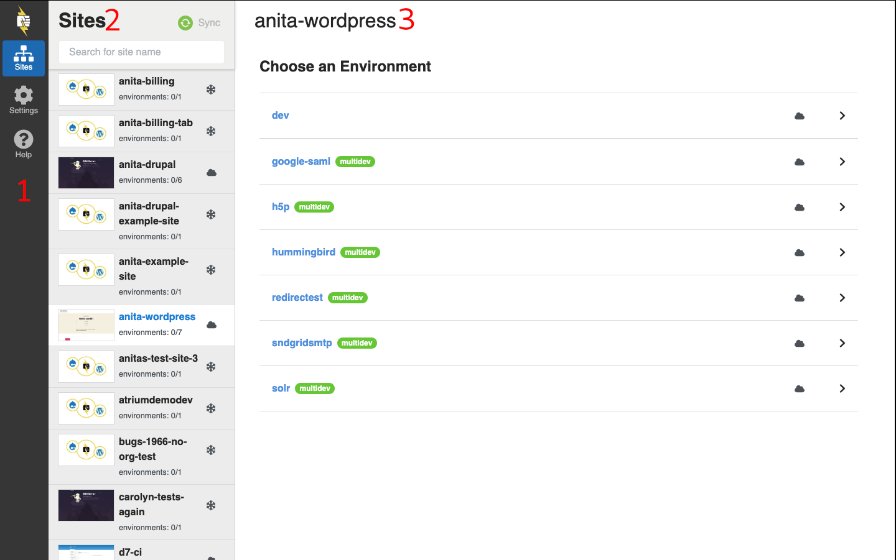
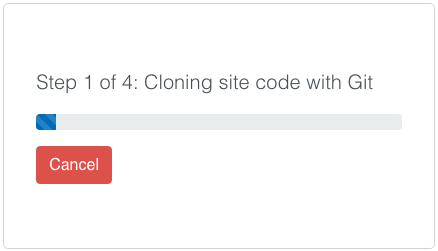
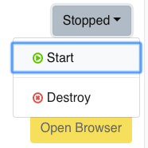

1. The global navigation, from which you can switch between [Sites](#connect-and-clone-your-site-locally), [Settings](#settings), and [Help](#help).

1. The Sites list, which lists all sites your user has permissions for. Use **Sync** to refresh the list when sites are added or removed.

1. After selecting a site, the main interface provides access to each site's environments, and the actions for each one.

## Connect and Clone your Site Locally

Select a site from the **Sites** list, and **Choose an Environment** if the site has any Multidev environments. Click **Pull for local development** to clone the site locally and boot the local environment. This process will take several minutes.

Each site is cloned to its own directory within `~/Localdev/` by default. If your site specifies a nested docroot with `web_docroot: true` in its [pantheon.yml](/pantheon-yml/#site-local-configurations-pantheonyml) or [pantheon.upstream.yml](/pantheon-yml/#custom-upstream-configurations-pantheonupstreamyml) file, the site's web root will be located in the `web` subdirectory.

Since this is the first time you are cloning the entire site code, this will take several minutes. Unless you [reset Localdev to its defaults](#log-out-and-reset-to-defaults), you will only need to do this once per site.

If there are any errors, Localdev will revert all changes and return you to the "Clone the dev environment" screen. Try the process again, then consult the [Troubleshooting section](#faq-troubleshooting-and-support) below for how to contact Support.

Otherwise, the main interface will bring to to the Site Screen:

### Start and Stop the Container

When you first pull a Site for local development, Localdev automatically starts a set of containers that closely resembles [Pantheon's Platform architecture](https://pantheon.io/features/elastic-hosting?docs). This allows you to develop your site locally, without risking compatibility issues once synced.

To start a stopped site container, click the grey **Stopped** button in the upper right-hand corner and click **Start** to start the local server.

Once the container has been started, you can preview the site from the <i className="fa fa-wrench"></i> **Develop** tab, on the **Local Site** row by clicking the **Open Browser** button. Sync changes using the <i className="fa fa-arrow-down"></i> **Pull** and <i className="fa fa-arrow-up"></i> **Push** tabs.

### Develop

From the **<i className="fa fa-wrench"></i> Develop** tab, you can:

- View the local site from **Open Browser**.

- View the [Site Dashboard](/sites) on Pantheon from **Open Dashboard**.

- View your local site files from **Open Finder**.

- SSH into the local site container to run [Composer](/composer) [Drush](/drush), [WP-CLI](/wp-cli), or [Terminus](/terminus) commands from **Launch Terminal**. Note that this will connect into the container shell, not just the terminal environment for your local computer.

- View the database container information and access [phpMyAdmin](https://www.phpmyadmin.net/) if enabled from the [Config](#Config) tab.

- Access email caputure through [MailHog](https://github.com/mailhog/MailHog), if enabled from [Config](#config).

### Push and Pull Code

If you have a Git client that you're already comfortable with, you can use it to track, commit, push, and pull code as you normally would. Navigate or point your Git client to track your local code directory, for example: `/Users/yourUser/Localdev/examplesite`.

To have Localdev deal with Git for you, use the **<i className="fa fa-arrow-down"></i> Pull** and **<i className="fa fa-arrow-up"></i> Push** tabs.

In **Pull** tab, check the **Pull code** option to copy the site's code from the Pantheon Dev environment to your local environment. The *Last Pull* line below each option's area shows the last time the code was synched.

After you make changes to your site:

1. Navigate to the **<i className="fa fa-arrow-up"></i> Push** tab

1. Select the information you want pushed to the Pantheon Development environment

1. Enter a **Git commit message** that describes the changes made in this particular push

1. Click **Push**

## Push and Pull Content

The **<i className="fa fa-arrow-down"></i> Pull** and **<i className="fa fa-arrow-up"></i> Push** tabs also let you sync content (files and/or database) from the Pantheon platform to your Localdev environment.

<Alert title="Warning" type="danger">

Pantheon does not recommend pushing your database or files from your local environment to the platform, as this can result in the *permanent* loss of data. There are exceptions to this rule, but in general it is best to only pull content down from the platform, and push code up.

Pulling content will *overwrite* your local working data. If you need to keep a copy, export the database using phpMyAdmin and make a copy of your files.

</Alert>

### Config

From the **<i className="fa fa-cog"></i> Config** tab for a site, you can initialize tools like [phpMyAdmin](https://www.phpmyadmin.net/) or [MailHog](https://github.com/mailhog/MailHog), enable [CDN](/global-cdn) emulation to test cookies, or enable [Solr](/solr) / [Redis](/redis) for the local site.

### Advanced

From the **<i className="fa fa-bolt"></i> Advanced** tab, you can

- Change the verbosity in the **<i className="fa fa-bug"></i> Logs** tab,
- Initiate a force rebuild (see [troubleshooting](/guides/localdev/troubleshoot-support) for more information),
- Force-remove the entire application, which will also destroy all local site databases.

### Logs

**<i className="fa fa-bug"></i> Logs** provides three views:

- Activity shows what actions have been taken from the app.

- Console shows updates to the binary log file for the tools used by Localdev under the hood. Note that it will only display log updates created while the console view is open.

- Logs (beta) shows the application logs for Lando and any underlying tools like Localdev or Docker.

  - When viewing logs, the links at the bottom allow you to switch between the various containers for your site's environment, including the appserver, redis / solr, nginx, mailhog, and phpmyadmin (if enabled).

## Use a Local IDE to Develop your Pantheon Site

There are a number of IDEs that have built-in Git tools or plugins available for working with Git from within the IDE:

- [Atom](https://atom.io/)
- [Sublime Text](https://www.sublimetext.com/)
- [TextMate](https://macromates.com/)
- [Visual Studio Code](https://code.visualstudio.com)
- [PhpStorm](https://www.jetbrains.com/phpstorm)

See your editor's documentation for specific steps on how to commit and push changes from inside the editor.
