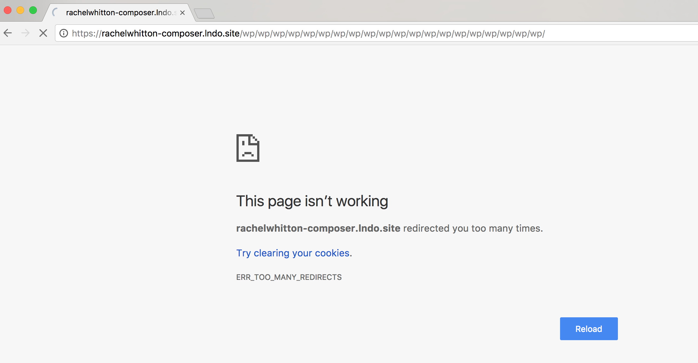

After you have required HTTPS for all pages by adding the [necessary redirect](/domains/#redirect-to-https-and-the-primary-domain), set the HTTP Strict Transport Security (HSTS) header to standardize all client connections on HTTPS and prevent use of HTTP.

Not only does this header help you get an A+ SSL rating from [SSL Labs](https://www.ssllabs.com/ssltest/), it will help protect your website against protocol downgrade attacks and cookie hijacking.

<Alert title="Note" type="info">
Before adding HSTS to your site, you should review and understand the configuration options that are available. A HSTS header that is configured incompletely or not securely enough diminishes the security protection that HSTS provides.
</Alert>

## Deploy and Configure a HSTS Header by Module or Plugin
The HTTP Strict-Transport-Security response header (often abbreviated as **HSTS**) is a website security feature that tells browsers to only communicate using HTTPS, instead of HTTP.

<TabList>

<Tab title="WordPress" id="tab-1-id" active={true}>

Install and activate the [LH HSTS](https://wordpress.org/plugins/lh-hsts/) plugin using the WordPress Dashboard (`/wp-admin/plugin-install.php?tab=search&s=lh+hsts`) or with [Terminus](/terminus/):

```bash
terminus remote:wp <site>.<env> -- plugin install lh-hsts --activate
```

Once enabled, the following header will be sent in responses:

```http
Strict-Transport-Security: max-age=15984000; includeSubDomains; preload
```

<Accordion title="Troubleshooting" id="unique-anchor" icon="wrench">

#### Nested Docroot

Site's using our [nested docroot](/nested-docroot/) feature to serve WordPress from a subdirectory will experience a redirect loop upon activation of the LH HSTS plugin:



There is an [open issue](https://wordpress.org/support/topic/broken-website-9/) to address the problem with currently no known workaround.

As an alternative for sites served from a subdirectory, we recommend disabling the LH HSTS plugin and using a custom PHP function <Popover title="Custom PHP Functions" content="Best practice would be to write a custom plugin for the following since it is related to the functionality of your site, not it's design or layout. However, you can add the custom function to a Child Theme's function.php file as a quick fix. Keep in mind, managing this functionality within the theme's functions.php file means it will not persist when swapping themes." /> to send the HSTS header:

```php
/**
*
* Example custom function to add the HSTS header while rendering a response.
*
**/
add_action( 'send_headers', 'add_header_hsts' );
function add_header_hsts() {
   header('Strict-Transport-Security: max-age=15984000; includeSubDomains; preload');
}
```

See the [WordPress documentation](https://codex.wordpress.org/Plugin_API/Action_Reference/send_headers) for more details.

</Accordion>


</Tab>

<Tab title="Drupal 8" id="tab-2-id">

1. Install the [HTTP Strict Transport Security](https://drupal.org/project/hsts) module using the [Drupal interface](https://www.drupal.org/docs/8/extending-drupal-8/installing-modules) or with [Terminus](/terminus/):

    ```bash
    terminus remote:drush <site>.<env> -- pm-enable hsts --yes
    ```

2. Visit the module configuration page (`/admin/config/system/hsts`).
3. Check the **Enable HTTP Strict Transport Security** checkbox, set **Max Age** to at least **1 year** and click **Save Configuration**.

Once installed and configured, the following header will be sent in responses:

```http
strict-transport-security: max-age=31536000
```

</Tab>

<Tab title="Drupal 7" id="tab-3-id">

1. Install the [HTTP Strict Transport Security](https://drupal.org/project/hsts) module using the [Drupal interface](https://www.drupal.org/docs/7/extending-drupal/installing-modules) or with [Terminus](/terminus):

  ```bash
  terminus remote:drush <site>.<env> -- pm-enable hsts --yes
  ```

2. Visit the module configuration page (`/admin/config/security/hsts`).
3. Check the **Enable HTTP Strict Transport Security** checkbox, set **Max Age** to **15552000** and click **Save Configuration**.

Once installed and configured, the following header will be sent in responses:

```http
strict-transport-security: max-age=15552000
```

</Tab>

</TabList>

## HSTS Header Configuration Attributes
Once you've installed the module or plugin you plan to use, you should immediately configure the `strict-transport-security` header attributes as appropriate for your site. There are three attributes you should configure for the `strict-transport-security` header:

<DefList>

<Definition title="max-age=expire-time">

The time, in seconds, that the browser should remember that this site is only to be accessed using HTTPS. You might want to set the max-age to as low as 5 minutes or 1 day as you first add and configure the HSTS header so that you can check that your site does not exhibit any unexpected access issues. With a very low max-age you can change the settings quickly until you complete testing. Then you would more optimally set the max-age to 1 year or even two years.

</Definition>

<Definition title="includeSubDomains">

Optional, but usually advisable to use this attribute. If this optional parameter is specified, your HSTS header applies to all of your site's subdomains as well. If you do not use the includeSuDomains attribute, your site may still have unintended security issues exposed when users access subdomains of your site.

</Definition>

<Definition title="preload">

An important to understand, but optional attribute supported by all modern major browsers. Optimally, you should only add the preload attribute after you have tested your site using your HSTS header configured with max-age and includeSubDomains. The preload list is a list of domains baked into browsers that a browser consults before sending a request for a site. If your site is in the preload list, all requests for your site will be sent via HTTPS no matter what the user types into the browser address bar and this will occur even before the browser first ever sees your site's actual HSTS header. [Here is where you add your site to the preload list](https://hstspreload.org/).

</Definition>

</DefList>

How you configure or include these attributes raises the rigor of the security that your HSTS effort provides. [Here is a great overview of how and why to use the above noted attributes](https://hstspreload.org/).

## HSTS Before the Application Level
The configuration described above sets the HSTS header when the CMS loads. If you need HSTS to be set before that, consider a CDN-level implementation from a third-party provider like Cloudflare to [enable SSL first](/cloudflare/#option-2-use-cloudflares-cdn-stacked-on-top-of-pantheons-global-cdn), then [enable HSTS](https://support.cloudflare.com/hc/en-us/articles/204183088-Understanding-HSTS-HTTP-Strict-Transport-Security-) from their end.

## See Also
For additional details on this header, see:

 - [HTTP Strict Transport Security Cheat Sheet](https://www.owasp.org/index.php/HTTP_Strict_Transport_Security_Cheat_Sheet)
 - [The CIO Council](https://https.cio.gov/hsts/) overview on HSTS.
