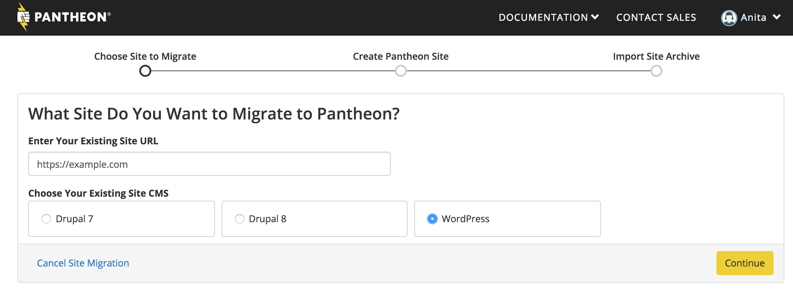
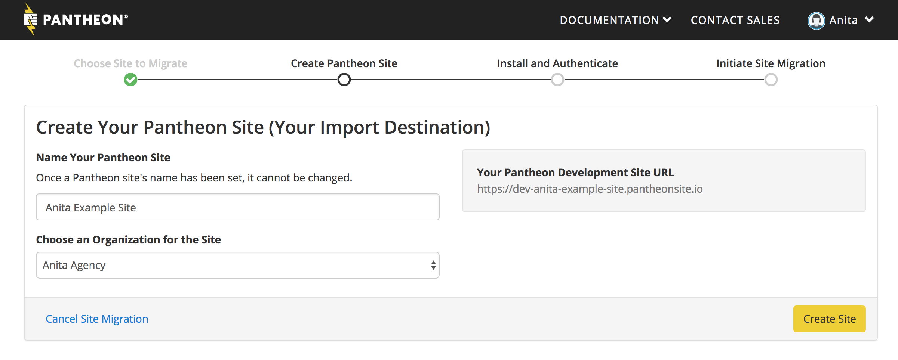
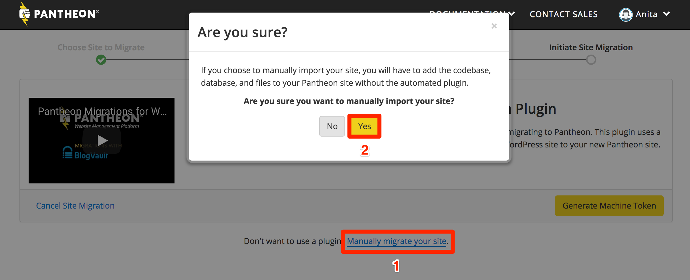
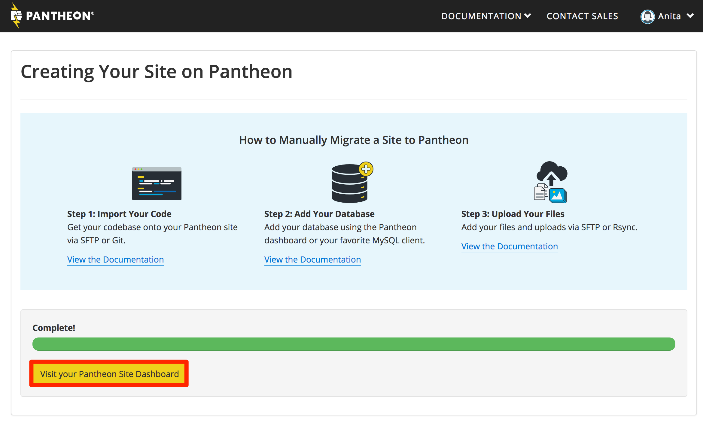
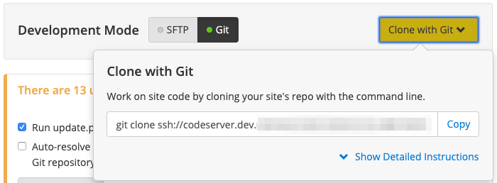
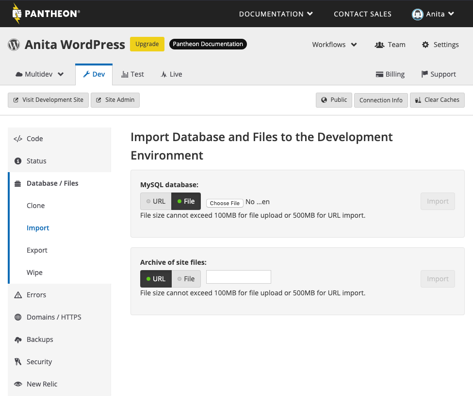
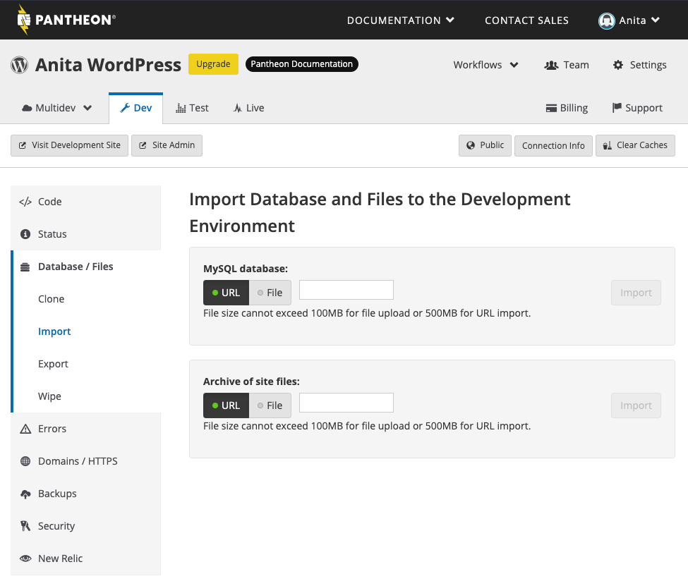
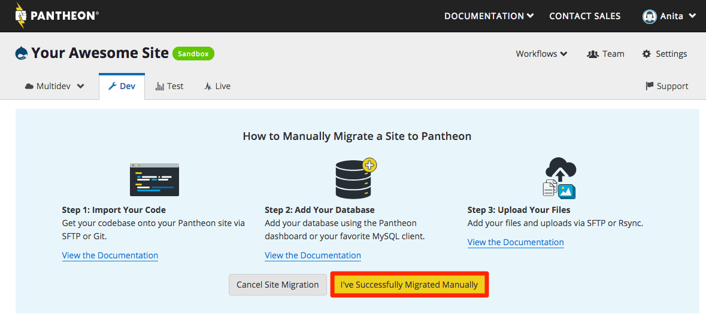

Manually migrate your site to Pantheon when any of the following apply:

- **Large Drupal Site Archive**: Site archive exceeds the import file size limit of 500MB.
- **Large WordPress Site**: WordPress site exceeds 500MB.
- **Preserve Git History**: You'd like to preserve your site's existing Git commit history.
- **[WordPress Site Networks](/guides/multisite)**
- **Plugin install unavailable on existing WordPress site**: For example, if your existing site is hosted on WordPress.com, you'll be unable to install the Pantheon Migrations plugin.
- **Local WordPress Site**: If your WordPress site is only on your local machine and not yet live.
- **Debug Failed Migration**: It can be helpful to migrate your code, database, and files separately if the standard migration procedure failed.

If none of the above apply to your project, use the [standard migration procedure](/migrate).

<Alert title="Note" type="info" >

The steps outlined below do not work for Composer-based sites. If you have need help migrating a Composer-based site (or any site, for that matter), site migrations are one of the services offered by our [Professional Services](/professional-services/#site-migrations) team.

</Alert>

## Before You Begin

To ensure a successful migration, complete the following tasks on the source site before you start:

- Read [Platform Considerations](/platform-considerations)
- Upgrade to the latest version of WordPress or Drupal core
- Reference your plugins and/or modules against [Modules and Plugins with Known Issues](/modules-plugins-known-issues)
- Make sure your code is compatible with PHP 7.2. If not, be prepared to [adjust PHP versions](/php-versions/#configure-php-version)
- Clear all caches
- Remove unneeded code, database tables, and files
- [Configure SSH keys](/ssh-keys)

<Accordion title="Advanced Tips for Successful Migration" id="advanced-before-you-begin" icon="lightbulb">

#### .gitignore

Check the contents of your current codebase for existing `.gitignore` files. To be compatible with the platform, using the Pantheon version is advised.  Otherwise, attempts to import files to restricted paths could break the import process. See the platform-provided versions for [WordPress](https://github.com/pantheon-systems/WordPress/blob/default/.gitignore), [Drupal 7](https://github.com/pantheon-systems/drops-7/blob/master/.gitignore), and [Drupal 8](https://github.com/pantheon-systems/drops-8).

#### Local Drupal configurations

To preserve the database connection credentials for a site built on a local development environment, and to exclude them from version control, move your `settings.php` file to `settings.local.php` and add it to `.gitignore` so that it will be ignored by Git and included from Pantheon's `settings.php` when working on your site locally. Make sure that you can modify it, and restore the protections after the move:

```bash{promptUser: user}
chmod u+w sites/default/{.,settings.php}
mv sites/default/{settings.php,settings.local.php}
chmod u-w sites/default/{settings.local.php,.}
```

Drupal 8 sites running on Pantheon come with a bundled `settings.php` that includes the `settings.local.php` file, so no additional steps are required. However, sites running Drupal 6 or 7 must add a `settings.php` file that includes `settings.local.php`, as this file is not bundled on Pantheon.

</Accordion>

## Create Pantheon Site

1. Navigate to your User Dashboard and click the **Migrate Existing Site** button:

   

1. Enter your current website URL, choose your site type (Drupal 7, Drupal 8, or WordPress,), and click **Continue**:

   

   Note: It is possible to upload a site running locally by putting in the local url. For example, (`http://localhost`).

1. Name your site and select an [Organization](/organizations) (optional), then click **Create Site**:

   

1. Click the link to manually migrate your site then select **Yes** to confirm:

  <TabList>

  <Tab title="WordPress" id="wp-confirm" active={true}>

  

  </Tab>

  <Tab title="Drupal" id="drops-confirm">

  

  </Tab>

  </TabList>

1. Click **Visit your Pantheon Site Dashboard**:

  

Now that you have a new site on Pantheon, you're ready to add the major components from your existing site: custom code, files, and the database.

## Import Your Code

Your **code** is all custom and contributed modules or plugins, themes, and libraries. The codebase should not include the `wp-content/uploads` (WordPress) / `sites/default/files` (Drupal) directory, or any other static assets you do not want tracked by version control.

  <Partial file="code.md" />

  <Alert title="Note" type="info">

  If your existing site is already version controlled and you would like to preserve the commit history, import the code from the command line with Git using the instructions below. If you prefer to avoid the command line entirely, we suggest importing the codebase using an SFTP Client such as [Transmit](https://panic.com/transmit/) or [Cyberduck](https://cyberduck.io/).

  </Alert>

### Using an SFTP Client

1. Navigate to **<span class="glyphicons glyphicons-embed-close"></span> Code** in the **<span class="glyphicons glyphicons-wrench"></span> Dev** tab of your Site Dashboard. Confirm that Development Mode is set to **SFTP**.

1. Click **Connect with SFTP** to access the credentials for connecting to your preferred SFTP client.

1. Click **Open SFTP Client** to open your default local SFTP client, and enter your User Dashboard password when prompted.

  If you run into issues, please refer to Pantheon's [SFTP documentation](/sftp#sftp-connection-information).

1. Do not overwrite WordPress or Drupal core files on your Pantheon site. Upload your existing site's themes as well as plugins or modules to their locations within the root directory (`code` or `wp-content`, as shown below).

  <TabList>

  <Tab title="WordPress" id="wp-code" active={true}>

  Copy the following directories from your existing site to a matching directory in your new site's `code/wp-content` directory:

   - `mu-plugins`
   - `plugins`
   - `themes`

  As well as any other folders under `wp-content` that are *not* `wp-content/uploads`.

  </Tab>

  <Tab title="Drupal 7" id="d7-code">

  Copy all files and folders inside the `code/sites` directory, *except* `code/sites/default/files` from your existing site to a matching directory in your new site's `code/sites`:

   - `libraries`
   - `modules`
   - `profile`
   - `themes`
   - `vendor`
   - `sites`, excluding `sites/default/files`.

  Refer to the "Custom and contrib parts of your Drupal project" section of [Basic Directory Structure of a Drupal 7 Project](https://www.drupal.org/node/2621480) for more details.

  </Tab>

  <Tab title="Drupal 8" id="d8-code">

  Copy the following directories from your existing site to a matching directory in your new site's `code/sites` directory:

   - `libraries`
   - `modules`
   - `profile`
   - `themes`
   - `vendor`
   - `sites`, excluding `sites/default/files`.

  Refer to the "Base-Level Directories" section of [Drupal 8 Directory Structure](https://www.drupal.org/docs/8/understanding-drupal-8/directory-structure) for more details.

  </Tab>

  </TabList>

1. Return to the Site Dashboard on Pantheon, and you should see quite a few files ready to be committed to version control. Write a commit message such as "Import existing codebase" then click **Commit**.

### From the Command Line with Git

1. Navigate to your existing site's code directory in a local terminal. If your existing code is _not_ already version controlled with Git, create a repository and add an initial commit:

    ```bash{promptUser: user}
    git init
    git add .
    git commit -m "initial commit"
    ```

1. From the **<span class="glyphicons glyphicons-wrench"></span> Dev** environment of the Site Dashboard, set the site's Development Mode to Git:

  

1. Copy the SSH URL for the site repository. *Do not copy* `git clone` or the site name.

  The URL should look similar to the following:

  ```bash
  ssh://codeserver.dev.{site-id}@codeserver.dev.{site-id}.drush.in:2222/~/repository.git
  ```

1. Add your new Pantheon site as a remote destination for your local code repository (replace `<ssh_url>` with the SSH URL copied in the previous step):

  ```bash{promptUser: user}
  git remote add pantheon <ssh_url>
  ```

1. Select the appropriate version of Git running on your local machine (`git --version`), then merge the codebase from your new Pantheon site with your existing site's codebase:

  <TabList>

  <Tab title="Git 2.8 and Below" id="28-step6">

  ```bash{promptUser: user}
  git pull --no-rebase --squash -Xtheirs pantheon master
  ```

  </Tab>

  <Tab title="Git 2.9 and Above" id="29-step6"  active={true}>

  ```bash{promptUser: user}
  git pull --no-rebase --squash -Xtheirs pantheon master --allow-unrelated-histories
  ```

  </Tab>

  </TabList>

  The output will resemble:

  ```bash
  Squash commit -- not updating HEAD
  Automatic merge went well; stopped before committing as requested
  ```

  If you haven't already configured [SSH Keys](/ssh-keys), authenticate using your Pantheon Dashboard credentials when prompted for a password.

1. Review your current index using `git status`, then commit all changes:

  ```bash{promptUser: user}
  git add .
  git commit -m "Adding Pantheon core files"
  ```

1. Align your local branch with its remote counterpart on Pantheon:

  <TabList>

  <Tab title="Git 2.8 and Below" id="28-step8">

  ```bash{promptUser: user}
  git pull pantheon master --no-rebase
  ```

  </Tab>

  <Tab title="Git 2.9 and Above" id="29-step8" active={true}>

  ```bash{promptUser: user}
  git pull pantheon master --no-rebase --allow-unrelated-histories
  ```

  </Tab>

  </TabList>

1. Push your newly merged codebase up to your Pantheon site repository:

  ```bash{promptUser: user}
  git push pantheon master
  ```

1. Go to the **<span class="glyphicons glyphicons-embed-close"></span> Code** tab of your **<span class="glyphicons glyphicons-wrench"></span> Dev** environment on the Site Dashboard. You should see your site's pre-existing commit history and the most recent commit adding Pantheon's core files.

## Add Your Database

The **Database** import requires a single `.sql` dump that contains the site's content and configurations.

1. Create a `.sql` dump using the [mysqldump](https://dev.mysql.com/doc/refman/5.7/en/mysqldump.html) utility. To reduce the size for a faster transfer, we recommend you compress the resulting archive with gzip:

  ```bash{promptUser: user}
  mysqldump -uUSERNAME -pPASSWORD DATABASENAME > ~/db.sql
  gzip ~/db.sql
  ```

   - Replace `USERNAME` with a MySQL user with permissions to access your site's database.
   - Replace `PASSWORD` with the MySQL user's password. You can also move `-p` to the end of the command and leave it blank, to be prompted for your password. This prevents your MySQL password from being visible on your terminal.
   - Replace `DATABASE` with the name of your site database within MySQL.
   - `~/db.sql` defines the output target to a file named `db.sql` in your user's home directory. Adjust to match your desired location.

  The resulting file will be named `db.sql.gz` You can use either the Pantheon Dashboard or a MySQL client to add your site's database.

1. From the Site Dashboard, select the **<span class="glyphicons glyphicons-wrench"></span> Dev** environment.

1. Select **<span class="glyphicons glyphicons-server"></span> Database / Files**.

1. Click **Import** and add your archive accordingly (based on file size):

  <TabList>

  <Tab title="Up to 100MBs" id="100mbs" active={true}>

  If your archive is under 100MB, you can upload the file directly:

   1. In the **MySQL database** field, click **File**, then **Choose File**.

   2. Select your local archive file, then press **Import**.

   

  **Note:** if you recently imported the database and need to re-import, refresh the page and use a new filename for the database file.

  </Tab>

  <Tab title="Up to 500MBs" id="500mbs">

  If your archive is less than 500MB, you can import it from URL:

   1. In the **MySQL database** field, click **URL**.

   1. Paste a publicly accessible URL for the `.sql.gz` file, and press **Import**. Change the end of Dropbox URLs from `dl=0` to `dl=1` so we can import your archive properly.

      

  </Tab>

  <Tab title="Over 500MBs" id="500mbsplus">

  The following instructions will allow you to add database archives larger than 500MBs using the command line MySQL client, but you can also use a GUI client like Sequel Pro or Navicat. For more information, see [Accessing MySQL Databases](/mysql-access).

   1. From the **<span class="glyphicons glyphicons-wrench"></span> Dev** environment on the Pantheon Site Dashboard, click **Connection Info** and copy the Database connection string. It will look similar to this:

    ```bash{promptUser: user}
    mysql -u pantheon -p{random-password} -h dbserver.dev.{site-id}.drush.in -P {site-port} pantheon
    ```

   1. From your terminal, `cd` into the directory containing your `.sql` file. Paste the connection string and append it with: `< database.sql`. Your command will look like:

    ```bash{promptUser: user}
    mysql -u pantheon -p{random-password} -h dbserver.dev.{site-id}.drush.in -P {site-port} pantheon < database.sql
    ```

    If you encounter a connection-related error, the DB server could be in sleep mode. To resolve this, load the site in your browser to wake it up, and try again. For more information, see [Troubleshooting MySQL Connections](/mysql-access/#troubleshooting-mysql-connections).

   3. After you run the command, the `.sql` file is imported to the **<span class="glyphicons glyphicons-wrench"></span> Dev** environment.

  </Tab>

  </TabList>

## Upload Your Files

**Files** refer to anything within `sites/default/files` for Drupal or `wp-content/uploads` for WordPress, which typically includes uploaded images, along with generated stylesheets, aggregated scripts, etc. Files are not under Git version control and are stored separately from the site's code.

You can use the Pantheon Dashboard, SFTP, or Rsync to upload your site's files.

1. Export a `tar.gz` or `.zip` file of your files directory:

  <TabList>

  <Tab title="WordPress" id="files-wp-anchor" active={true}>

  Navigate to your WordPress site's root directory to run this command, which will create an archive file in your user's home directory:

  ```bash{promptUser: user}
  cd wp-content/uploads
  tar -czf ~/files.tar.gz .
  ```

  </Tab>

  <Tab title="Drupal" id="files-drops-anchor">

  Navigate to your Drupal site's root directory to run this command, which will create an archive file in your user's home directory:

  ```bash{promptUser: user}
  cd sites/default/files
  tar -czf ~/files.tar.gz .
  ```

  </Tab>

  </TabList>

1. From the Site Dashboard, select the **<span class="glyphicons glyphicons-wrench"></span> Dev** environment.
1. Select **<span class="glyphicons glyphicons-server"></span> Database / Files**.
1. Click **Import** and add your archive accordingly (based on file size):

  <TabList>

  <Tab title="Up to 100MBs" id="100mbsfiles-id" active={true}>

  If your archive is under 100MB, you can upload the file directly:

   1. In the **Archive of site files** field, click **File**, then **Choose File**.

   1. Select your local archive file, then press **Import**.

  </Tab>

  <Tab title="Up to 500MBs" id="500mbsfiles">

  If your archive is less than 500MB, you can import it from URL:

   1. In the **Archive of site files** field, click **URL**.

   1. Paste a publicly accessible URL for the archive, and press **Import**. Change the end of Dropbox URLs from `dl=0` to `dl=1` so we can import your archive properly.

  </Tab>

  <Tab title="Over 500MBs" id="500mbsplusfiles">

  Rsync is an excellent method for transferring a large number of files. After performing an initial rsync, subsequent jobs will only transfer the latest changes. This can help minimize the amount of time a site is in an unpredictable state (or offline) during the final step of migration, as it allows you to bring over only new content rather than re-copying every single file.

  We recommend looking into the [Terminus Rsync Plugin](https://github.com/pantheon-systems/terminus-rsync-plugin) as a helper when doing these operations, as the number of command line arguments and specifics of directory structure make it easy for human error to impact your operation.

  To sync your current directory to Pantheon:

  ```bash{promptUser: user}
  terminus rsync . my_site.dev:files
  ```

  When using Rsync manually, the script below is useful for dealing with transfers being interrupted due to connectivity issues. It uploads files to your Pantheon site's **<span class="glyphicons glyphicons-wrench"></span> Dev** environment. If an error occurs during transfer, it waits 180 seconds and picks up where it left off:

  ```bash
  ENV='dev'
  SITE='SITEID'

  read -sp "Your Pantheon Password: " PASSWORD
  if [[ -z "$PASSWORD" ]]; then
  echo "Whoops, need password"
  exit
  fi

  while [ 1 ]
  do
  sshpass -p "$PASSWORD" rsync --partial -rlvz --size-only --ipv4 --progress -e 'ssh -p 2222' ./files/* --temp-dir=../tmp/ $ENV.$SITE@appserver.$ENV.$SITE.drush.in:files/
  if [ "$?" = "0" ] ; then
  echo "rsync completed normally"
  exit
  else
  echo "Rsync failure. Backing off and retrying..."
  sleep 180
  fi
  done
  ```

  </Tab>

  </TabList>

You should now have all three of the major components of your site imported into Pantheon. Clear your caches on the the Pantheon Dashboard, and you are good to go! Once everything looks good, click **I've Successfully Migrated Manually**:



## Troubleshooting

### fatal: Not possible to fast-forward, aborting.

This error may occur when trying to merge Pantheon's codebase into your existing repository as described earlier on this page in (step 5 of [importing your code from the command line](#from-the-command-line-with-git):

```bash
Not possible to fast-forward, aborting.
```

Depending on your Git version, you may see the following error instead:

```bash
fatal: refusing to merge unrelated histories
```

If you see this, it is possible your local Git configuration is disallowing non-fast-forward merges:

```conf
[pull]
rebase = TRUE
ff = only
```

In this case, you will want to remove `ff = only` from your `.gitconfig` file and try the merge command again.

## See Also

Check our standard migration procedure for related [Frequently Asked Questions](/migrate#frequently-asked-questions-faqs) and [Troubleshooting](/migrate#troubleshooting) tips.
