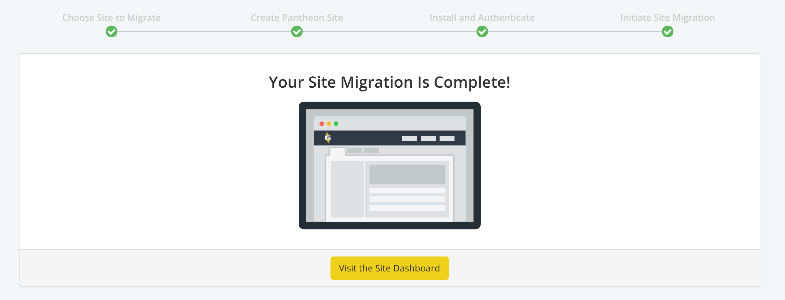
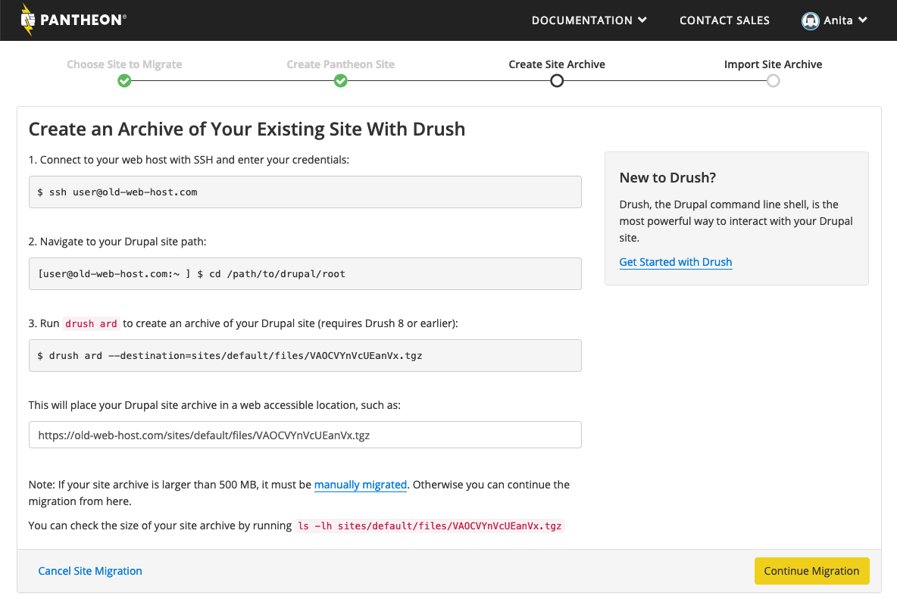
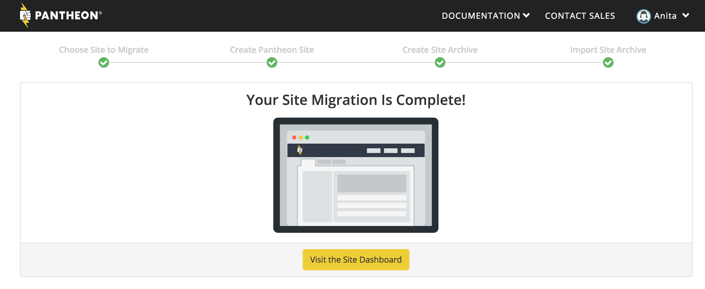

## Before You Begin
To ensure a successful migration, complete the following tasks on the source site first:

- Upgrade to the latest version of WordPress or Drupal core
- Clear all caches
- Remove unneeded code, database tables, and files
- Make sure to read [Platform Considerations](/platform-considerations/) and plan to mitigate any conflicts with the site needs or architecture.

## Migrate Existing Sites
Pantheon provides a guided path for migrating existing sites to the platform, which begins by clicking the **Migrate Existing Site** button on the User Dashboard.

<TabList>

<Tab title="WordPress" id="tab-1-id" active={true}>

The recommended way to migrate WordPress sites from another host is to use the [Pantheon Migration](https://wordpress.org/plugins/bv-pantheon-migration/) plugin, developed by [BlogVault](https://blogvault.net/).

<Accordion title="Watch: Guided WordPress Migrations" id="wp-video" icon="facetime-video">

`youtube: https://youtu.be/ksg1XkH1da8`

</Accordion>

1. Navigate to your User Dashboard and click the **Migrate Existing Site** button.

  
2. Enter your current website URL.
3. Select **WordPress**.
4. Click **Continue**.
5. Name your new Pantheon site.
6. Select an organization for the site (optional).
7. Click **Create Site**.
8. Select **Generate Machine Token** and re-authenticate if prompted.
9. Select **Install on /wp-admin** to install and activate the plugin on your existing site. Keep the Pantheon Dashboard tab open in your browser.
10. Copy the machine token from the Pantheon Dashboard, then navigate to **Pantheon Migration** within the WordPress Dashboard on your existing site. Paste the machine token and enter the site name.
11. Click **Migrate**. You will receive an email when the migration completes. After the migration is complete, select **Visit the Site Dashboard** from the Site Dashboard on Pantheon:

 

If the migration is not successful, contact <migrations@pantheon.io> and include a link to the Site Dashboard and any details you can provide, such as where you are migrating the site from. We will help troubleshoot up to five migrations with issues arising from the Pantheon Migrate plugin.

<Alert title="Note" type="info">

The <a class="external" href="https://wordpress.org/plugins/wp-native-php-sessions/">WordPress Native PHP Sessions</a> plugin is automatically installed during the migration process. For more details on this plugin, see [WordPress and PHP Sessions](/wordpress-sessions/).

</Alert>


</Tab>

<Tab title="Drupal" id="tab-2-id">

The recommended way to migrate Drupal sites from another host is to use `drush ard` (Drush 8 or earlier) to create an archive that can be easily imported.

1. Navigate to your User Dashboard and click the **Migrate Existing Site** button.

  

2. Enter your current website URL.
3. Select **Drupal 7** or **Drupal 8**.
4. Click **Continue**.
5. Name your new Pantheon site.
6. Select an organization for the site (optional).
7. Click **Create Site**.
8. Follow the instructions to **Create an Archive of Your Existing Site With Drush**:

  

  The Dashboard instructs you to put the archive on your existing website, but you can put the site archive on Dropbox, S3, or any number of other places. The important thing is that you have a site archive that can be downloaded via a publicly accessible URL.

9. Paste a publicly accessible URL to a download of your site archive. Change the end of Dropbox URLs from `dl=0` to `dl=1` so we can import your site archive properly.
10. Click **Import Archive**. After the imported is complete, select **Visit the Site Dashboard** from the Site Dashboard on Pantheon:

 


</Tab>

</TabList>

## Manually Migrate
Manually migrate your site to Pantheon when any of the following apply:

* **Large Drupal Site Archive**: Site archive is greater than the guided migration import limit of 500MB.
* **Large WordPress Site**: WordPress site exceeds 500MB.
* **Preserve Git History**: You'd like to preserve your site's existing Git commit history.
* **[WordPress Site Networks](/migrate-wordpress-site-networks/)**
* **Plugin install unavailable on existing WordPress site**: For example, if your existing site is hosted on WordPress.com, you'll be unable to install the Pantheon Migrations plugin.
* **Local WordPress Site**: If your WordPress site is only on your local machine and not yet live.
* **Debug Failed Migration**: It can be helpful to migrate your code, database, and files separately to help debug edge-cases that are not supported through guided migration.
* **Using Drush 9 or later**: `drush ard` is only available on Drush 8 and earlier.

For more details, see [Manually Migrate Sites to Pantheon](/migrate-manual/).

## Troubleshooting
This section describes the causes of, and solution to the error messages that are displayed on the Site Dashboard if the migration fails to complete.

If your code, database, and files have completed migrating, but your site is not working as you'd expect, please review [Pantheon Platform Considerations](/platform-considerations/). For example, if your site uses [PHP short tags](/platform-considerations/#php-short-tags), you'll need to convert them to standard PHP tags.

Next, check [log files](/logs/) to help identify and fix errors. Drupal or WordPress core is upgraded as part of migration, so you may have additional work to complete the upgrade.

### Migrate from Acquia

Acquia uses a nested docroot directory named `docroot`. When migrating from Acquia to Pantheon, you may choose to move the contents of `docroot` up and remove the folder, or rename it to `web` and set `web_docroot: true` in your `pantheon.yml` file. For more information on nested docroots, see [Serving Sites from the Web Subdirectory](/nested-docroot/).

### Could not import code, the import file does not appear to contain a valid code directory.

**Cause:** The migration tool could not find Drupal or WordPress core files. This prevents the migration from completing because the site modules, plugins, and/or themes cannot be imported. This error also occurs when multiple `settings.php` files are present.

**Solution:** Check that the archive includes a valid code root with all core files. If multiple `settings.php` files are present, delete them from the archive.

<TabList>

<Tab title="Drupal 8" id="d8" active={true}>

Archives for Drupal 8 sites should include `index.php` at the code root level, along with the following directories:

```
├── core
├── index.php
├── modules
├── profiles
├── sites
    └── all
        ├── modules
        └── themes
    └── default
        └── settings.php
└── themes
```

</Tab>

<Tab title="Drupal 7" id="d7">

Archives for Drupal 7 sites should include `index.php` at the code root level, along with the following directories:

```
├── includes
├── index.php
├── misc
├── modules
├── profiles
├── scripts
├── sites
    └── all
        ├── modules
        └── themes
    └── default
        └── settings.php
└── themes
```

</Tab>

<Tab title="WordPress" id="wp">

Archives for WordPress sites should include `index.php` at the code root level, along with the following directories:

```
├── index.php
├── wp-activate.php
├── wp-config.php
├── wp-comments-post.php
├── wp-blog-header.php
├── wp-admin
├── wp-cron.php
├── wp-load.php
├── wp-links-opml.php
├── wp-includes
├── xmlrpc.php
├── wp-trackback.php
├── wp-signup.php
├── wp-settings.php
├── wp-mail.php
├── wp-login.php
├── wp-content
    ├── index.php
    ├── mu-plugins
    ├── themes
    ├── plugins

```

</Tab>

</TabList>


### Could not import database, unable to locate a database dump.
**Cause:** The migration tool could not locate a MySQL database dump within the archive.

**Solution:** Ensure that the archive contains a valid MySQL database dump.

### Could not import database from PHPMyAdmin
**Cause:** PHPMyAdmin version 4.2 can create a database dump Drupal 8 is unable to import.

**Solution:** This issue is documented on [Drupal.org](https://www.drupal.org/node/2496331). Edit the DB dump as described [here](https://www.drupal.org/node/2496331#comment-10029863).

### Multiple file directories found within the import archive.
**Cause:** The migration tool found more than one potential location for files within the archive. This error also occurs if Drupal's private files directory is not placed within the public directory (`sites/default/files/private`).

**Solution:** All files must be moved into the standard location for your site's CMS (`/sites/default/files` for Drupal, and `/wp-content/uploads` for WordPress). For more details, see [Non-Standard Files Locations](/non-standard-file-paths).

### Multiple site directories found within the import archive.
**Cause:** The migration tool found a multisite installation, which is not supported on the platform.

**Solution:** Refer to [Extracting Sites from a Drupal Multisite](/unwind-drupal-multisite/).

### Multiple database dumps found within the import archive.
**Cause:** The migration tool detected multiple MySQL database dumps within the archive.

**Solution:** Ensure that a single MySQL dump is included within the archive.

### Multiple code roots found within the import archive.
**Cause:**  The migration tool detected more than one potential location for the code root in the archive.

**Solution:** Ensure that a single code root is included within the archive.

### Cannot Login Using a Google Account
Attempts to login with Google will fail if your organization uses Single Sign-On, resulting in the following error:


Click your browser's back button to re-authenticate by entering your email address and sign in with your SAML Identity Provider. For details, see [Single Sign-On for Pantheon Organizations](/sso-organizations/).

### Destination Site Not Found Error
If you are logged in with one identity and re-authenticate a different account, the site created will be associated with one account and the machine token with another, resulting in the following error:


Click your browser's back button from the Pantheon Dashboard and re-authenticate the user account for your current session.

### Import Failed in WordPress Migration
#### CDN Blocking POST requests
This error can occur on sites using a content delivery network (CDN) service that is not configured to allow the POST HTTP method. Resolve this issue by [temporarily setting POST as an allowed HTTP method within the CDN's configuration](https://docs.aws.amazon.com/AmazonCloudFront/latest/DeveloperGuide/distribution-web-values-specify.html#DownloadDistValuesAllowedHTTPMethods) and restarting the migration process. Once the site has been successfully migrated, the POST HTTP method can be disabled.

#### Very Large Site Footprints
Imports can also fail for very large sites, which may time out while importing. In these cases, initiate the migration again from the source site, and the transfer should pick up where it left off.

### Drush archive missing code or files
If you have an existing archive (tgz) file in `sites/default/files` the `drush ard` command may generate an archive without all expected components. Delete all archives and try running `drush ard` again.

### HTTP 404 error: Unable to download the archive
Go the to files directory of your existing site and check if the site archive was generated successfully. If you're hosting the archive on a third party like Dropbox or Google Drive, confirm that it was uploaded successfully. Visiting the archive link with a browser should download the files automatically. You may need to run the `drush ard` command again if you can't find the site archive.


## Frequently Asked Questions (FAQs)

### How do I clone an existing Pantheon site?
You can make a copy of a WordPress site on Pantheon by following the [standard migration procedure](#migrate-existing-sites) described above. The procedure does not deviate for WordPress sites already hosted on Pantheon and is preferred since it's built into the Site Dashboard.

Drupal 7, Drupal 8 and WordPress sites can use Terminus to clone one Pantheon site to another from the command line. This method requires you to [install and authenticate Terminus](/terminus/install), then install the [Terminus Site Clone](https://github.com/pantheon-systems/terminus-site-clone-plugin) plugin.

Replace `<source>` and `<destination>` with target [site UUIDs](/sites/#site-uuid) or site names, and specify target development environment in place of `<env>` (dev or multidev):

```bash
terminus site:clone <source>.<env> <destination>.<env>
```

<Alert title="Note" type="info">

File and database backups that exceed 500MBs are not supported by this method. Sites that exceed this limit must be cloned manually. For details, see [Manually Migrate Sites to Pantheon](/migrate-manual/).

</Alert>

### Does the WordPress migration cause downtime? 
No, there is no downtime expected as part of the migration process. For detals, see related [BlogVault resource (question #13)](https://blogvault.net/migration-using-blogvault-faq/). Performance implications to a live site are similar to running a backup for the site. 


### How do I migrate a local site to Pantheon?
When asked for your current site URL, enter `https://example.com` and continue the migration procedure in the Site Dashboard.

<TabList>

<Tab title="WordPress" id="tab-1-id" active={true}>

  The Pantheon Migration plugin for WordPress does not support local sites. WordPress users should [manually migrate](/migrate-manual).

</Tab>

<Tab title="Drupal" id="tab-2-id">

Drupal users with access to Drush 8 or earlier can run the provided Drush command to generate an archive then upload it to a third party service (like [Dropbox](https://www.dropbox.com/) or [Google Drive](https://drive.google.com)) to continue the standard migration procedure. If Drush 8 is not available, or the archive file size exceeds 500MB you must [manually migrate](/migrate-manual).

</Tab>

</TabList>

### How long does the WordPress migration process take?
Most migrations are completed within two hours. The migration time depends solely on the size of your site, so be aware that it may take more or less time than estimated. We will send you an email once your migration is complete. If there are any issues with the migration, we will notify you by email.

### Why doesn't my site archive import correctly from Dropbox?
Change the end of Dropbox URLs from `dl=0` to `dl=1` so we can import your site archive properly. See the Dropbox documentation: [How do I force a file or folder to download or render on dropbox.com?](https://www.dropbox.com/en/help/201)

### How do I use the Pantheon Migrations plugin with a custom WordPress upstream?
If you'd like your existing WordPress site to get one-click updates from your [Custom Upstream](/custom-upstream/), then the migration process will be slightly different.

1. The general process will be the same as a vanilla WordPress site, but start with **Create New Site** instead of **Migrate existing site**.

2. Name your new site, and be sure to add it to the organization with access to the Custom Upstream you want to use.

3. On the next page, choose your Custom Upstream, and complete the installation.

You can now proceed with the normal migration steps [outlined above](#migrate-existing-sites), starting at Step 8.

### How should I migrate a site with a custom Drupal-based upstream?
If you'd like your existing Drupal site to get one-click updates from your [Custom Upstream](/custom-upstream/), then the migration process will be slightly different. The general process will be the same as a vanilla Drupal site, but start with **Create New Site** instead of **Migrate existing site**. Then use `terminus site:import <site> <url>` to import your site archive, or follow the [Manual migration](/migrate-manual) instructions if your site archive exceeds file size limits.

### What if I can't use drush on my existing Drupal site?
As an alternative to `drush` you can manually export and migrate. For details, see [Manually Migrate Sites to Pantheon](/migrate-manual).

### Are database table prefixes supported?
See [WordPress known issues](/wordpress-known-issues/#table-prefixes).

### Is the MySQL MyISAM engine supported?
No. If any of your database tables are using the MyISAM engine you'll need to [convert them to InnoDB](/myisam-to-innodb/).

### Can I use multiple SQL files in the archive?
If multiple SQL files are present the import will fail. Only provide one `.sql` file per site archive.

### Can I use multiple settings.php files per site archive?
If multiple `settings.php` files are present the import will fail. Pantheon does not need the `settings.php` file to import the site. To prevent import problems, it's best to remove `settings.php`.

### How can I migrate from WP Engine?
Follow the [standard procedure for migrating WordPress sites to Pantheon](#migrate-existing-sites) as described above. Note that WP Engine blocks the Let's Encrypt challenge file, so you should schedule a [maintenance window](/guides/launch/domains/#maintenance-window) for HTTPS. If your migration fails, you can try the following workaround:

1. Create and download a backup point from WP Engine.
2. Unzip your site's backup point on your local machine.
3. Remove the WP Engine remnants. There are a few files you'll need to remove:
   - Drop-in plugins (e.g. `wpengine-common`) located at: `\wp-content\mu-plugins`
   - `.gitattributes` and `.gitignore` from the root folder
   - If object caching is enabled, remove the `object-cache.php` file located in `/wp-content`.
4. Replace existing `wp-config.php` with [Pantheon's `wp-config.php`](https://github.com/pantheon-systems/wordpress/blob/master/wp-config.php) file. Preserve necessary logic from your existing file.
5. Move the `mysql.sql` database out of the `wp-content` directory and into the project's root directory.
6. Follow the procedure to [manually migrate](/migrate-manual/) your site.

### How do I migrate a Drupal 6 site to Pantheon?
Anyone wishing to migrate a Drupal 6 site to Pantheon can work with one of our Long Term Support (LTS) partners: [Tag1 Consulting](https://tag1consulting.com/) or [myDropWizard](https://www.mydropwizard.com/drupal-6-lts). Both of these partners are experienced in supporting sites on the Pantheon platform and specialize in maintaining security and site functionality for Drupal 6 sites. Should you need to keep your site running on D6, you will be in excellent hands working with them.
