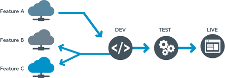
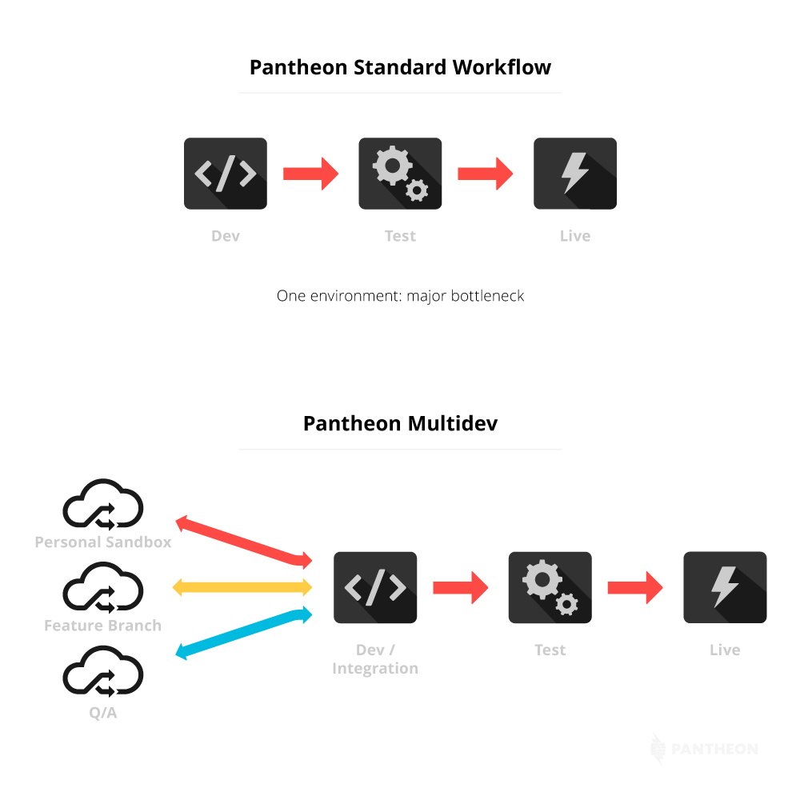
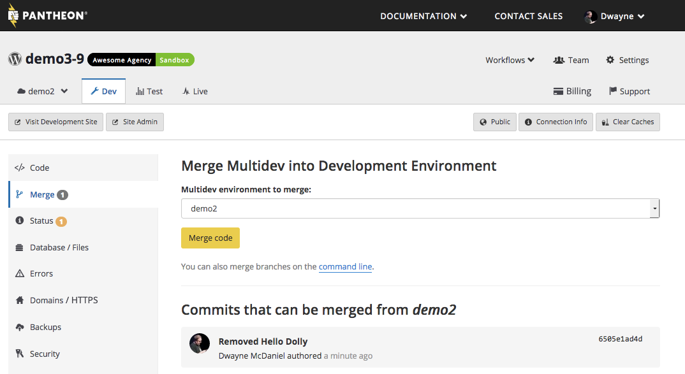

Multidev is development environments for teams and allows a developer to fork the entire stack (code and content), work independently, then merge the code changes back into the master. Each forked branch will have its own separate development environment, including database and files.



<Enablement title="Get WebOps Training" link="https://pantheon.io/agencies/learn-pantheon?docs">

Optimize your dev team and streamline internal workflows. Pantheon delivers custom workshops to help development teams master our platform and improve their internal WebOps.

</Enablement>

<Alert title="Note" type="info" >

To support the large number of web teams whose day-to-day operations are disrupted by the COVID-19 pandemic, we are making Multidev available for no additional charge to all customers through July 1, 2020. See the [blog post for more information](https://pantheon.io/blog/why-were-making-multidev-free-through-july-1st).

</Alert>

## Benefits of Multidev

**Easy workflow.** Developers on your team can use a standardized best-practice development workflow in the cloud through their Dashboard.

**No more surprises.** Multidev makes it easy to keep in sync with code from every team member and content updates from any environment. As a result, deployments become surprisingly predictable.

**A fork for every developer on your team.** Multidev gets new developers started quickly; you can’t have too many cooks in a Multidev kitchen.
​

## Branching and Multidev Terminology

Branching is a standard mechanism for duplicating source code under revision control for parallel development. In that context, Multidev is Pantheon’s support of a branching workflow using the Pantheon platform and Dashboard.

There are a number of terms used throughout the Multidev workflow:

<dl>

<dt>commit</dt>

<dd>

Record snapshot to history.

</dd>

<dt>push</dt>

<dd>

Send changes to a remote repository.

</dd>

<dt>branch</dt>

<dd>

Movable pointer to a set of commits, allowing independent development and history.

</dd>

<dt>environment</dt>

<dd>

Independent infrastructure for a site, including code, database, and files.

</dd>

<dt>fork</dt>

<dd>

To divide in branches, copying source code&nbsp;to start independent development. At Pantheon, we are also copying content (files and database) when forking.

</dd>

<dt>merge</dt>

<dd>

Combine contents of a&nbsp;branch into another, like a bug fix branch into master.

</dd>

<dt>master</dt>

<dd>

Name of default branch; deployed to Pantheon Dev, Test, and Live environments.

</dd>

</dl>

## Getting Started

1. From your Site Dashboard, click the **Multidev** tab.
2. Click **Create Multidev Environment**. This will create a new fork of the environment that you select, including code, database and files.
3. Specify the name for the environment; the URL will incorporate the environment name.

   <Alert title="Warning" type="danger">

   Multidev branch names must be all lowercase, be less than 11 characters, but may contain a dash (`-`). Environments cannot be created with the following reserved names: master, settings, team, support, multidev, debug, files, tags, and billing.

   </Alert>

4. Click **Create Environment**.

It will take a few minutes to create the environment and clone the content from the source environment. You can continue working on the Dashboard while it's being created.

You can create cloned Multidev environments from Dev, Test, or Live; existing branch environments can also be forked. Any branch not associated with an environment will be listed on Multidev > Git Branches.

<Alert title="Note" type="info">

The cache tables can contain entries that exceed the transaction redo limit set by `@innodb_log_file_size@`. If you receive an error message that the clone was aborted, clear caches on the source environment and retry the procedure.

</Alert>

You can also create an environment for an existing Git branch. Content can be cloned from any existing environment during the environment creation.

## Access a Branch Environment

From the Dashboard, click **Multidev**, then select the name of the environment.

Git instructions are shown under the Connection Mode section of the code page for all Dev and Multidev environments.

Once you have cloned your site's codebase to your local machine, you can work on a specific branch by using **git checkout `branch-name`** on the command line, or by checking out the necessary branch using your preferred Git client e.g. SourceTree, GitKraken, GitHub Desktop, etc.

Any changes you make to a branch you have checked out locally will be committed and pushed to the Multidev of the same name.

## Clone Content

1. Select the environment you want to clone content (files and database) into.
2. Click **Database / Files**.
3. Select the source environment in the **From this Environment** drop-down menu.
4. Select Database, Files, or both.
5. Choose whether to execute update.php after cloning, and click **Clone the Database & the Files from `source` into `target` Environment**.

## Edit Code
Edit your content locally via [Git](/git) or utilize on-server development via [SFTP](/sftp) mode.

### SFTP Mode
1. Navigate to the **Code** tab of the target Multidev environment within the Site Dashboard.
2. Set the connection mode to **SFTP** if it is not already set.
3. Use the WordPress or Drupal admin interfaces to develop, or connect via SFTP using your preferred client.
4. Type in a commit message for edits made via SFTP and click the **Commit** button.

### Git Mode
1. Navigate to the **Code** tab of the target Multidev environment within the Site Dashboard.
2. Set the connection mode to **Git** if it is not already set.
3. Select **Clone with Git** and copy the provided command. Paste the command in a terminal window to clone a copy of your site's code repository to your local.
4. From within the project's root directory, view existing branches using `git branch -a`.

  If the target environment's branch is _not_ listed, update the list by running `git fetch origin`. Once your local clone of the repository shows to be tracking the expected remote branch on Pantheon (e.g., `example-br`), switch to that branch:

  ```
  git checkout example-br
  ```

5. Make desired code changes, then stage, commit, and push to the Multidev environment. For example:

  ```
  git add .
  git commit -m "My code changes"
  git push origin example-br
  ```

## Merge Code

1. To merge code from a Multidev into the master branch on Dev, click the Dev tab.
2. Click **Merge**.
3. Select the environment with commits that can be merged into the target.
Instructions for using the command-line to merge the changes into the target are shown and can be pasted directly into the terminal without modification.



### Compare Multidev Environments Locally
The Multidev Environments page provides a list of all existing environments for a site, along with a quick comparison between environments and master (Dev). The "ahead" count represents the number of commits existing on the Multidev environment that have not been merged into master (Dev), while the "behind" count represents commits in master that do not exist on the Multidev branch.

Counts displayed on the Multidev Environments page are ordered by time of the commit, which can cause discrepancies in certain scenarios (e.g. if an existing commit was cherry-picked from one environment branch into another).

You can view a similar comparison locally by navigating to the site's root directory and running:
`git show-branch <multidev-name> origin/master`

The [`show-branch`](https://git-scm.com/docs/git-show-branch) output is formatted into two columns and color coded to illustrate which commits exist on the Multidev branch as compared to master (Dev).

## Delete a Branch Environment

Go to **Multidev** > **Multidev Environments**, and click **Delete Environment**.

When an environment is deleted, the branch will remain and needs to be removed manually.

## Delete a Branch

A branch with no environment associated with it can be deleted by going to Multidev > Git Branches and clicking **Delete Git Branch**.

Branches can be deleted locally and the commit can be pushed to Pantheon, but this may have unintended consequences if an environment is associated with it; use the interface instead.

## Rename a Branch
Branch names must be lowercase and no more than 11 characters. If you push a branch to Pantheon that exceeds the character limit or has uppercase letters, it cannot become a Multidev environment. The solution is to rename the branch. This is only recommended if you don't have any other users working on this branch, or if you have already coordinated with them.

From the command line, rename the branch:

```bash
git branch -m old-branch-name new-name
```

Next, push the renamed branch:

```bash
git push origin new-name
```

This will create a new branch with the commit history intact. From the Multidev Environments page, click **Git Branches** and delete the original branch. You will now be able to create an environment associated with the renamed Git branch.

## Troubleshooting and FAQs

For answers to the most frequently asked questions about Multidev, see our [Frequently Asked Questions](/multidev-faq).
