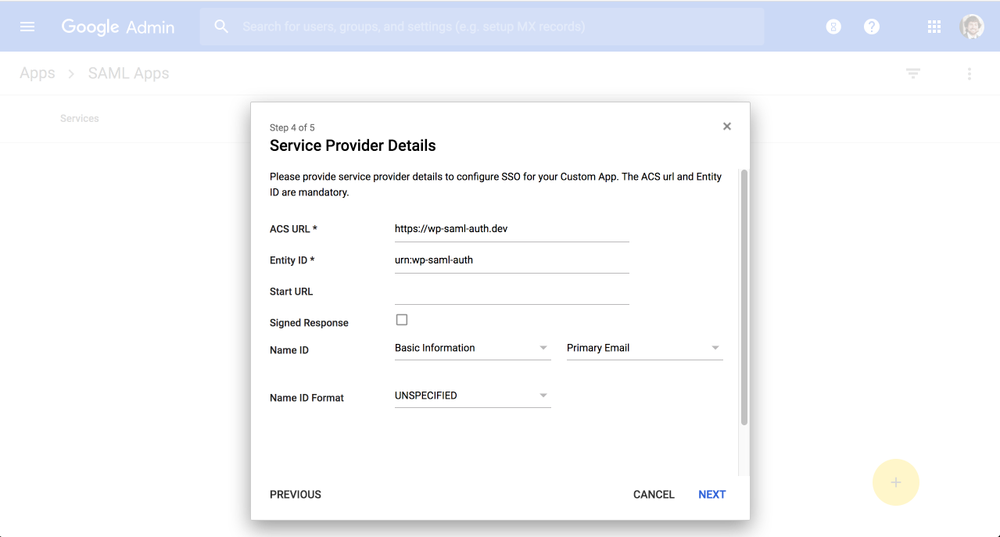

If your organization uses Google Apps, [WP SAML Auth](https://wordpress.org/plugins/wp-saml-auth/) lets your users sign into WordPress using their Google Account. This makes it much easier to manage user accounts; rather than recreate WordPress accounts for every user, you can treat Google Apps as your **Identity Provider** for **Single Sign-On** (SSO) and have WordPress defer to Google when determining who should have access and who shouldn’t.

## Before You Begin

First, setting up is a matter of applying the correct configuration. It should take an hour or less. If you get stuck on a configuration error along the way, please reach out by creating an issue on [this doc](https://github.com/pantheon-systems/documentation/issues/new?title=Using%20WP%20SAML%20Auth%20with%20Google%20Apps%20Doc%20Update%20&body=Re%3A%20%5BUsing%20WP%20SAML%20Auth%20with%20Google%20Apps%5D(https%3A%2F%2Fpantheon.io/docs/wordpress-google-sso/)%0A%0APriority%20(Low%E2%80%9A%20Medium%E2%80%9A%20High)%3A%0A%0A%23%23%20Issue%20Description%3A%0A%0A%23%23%20Suggested%20Resolution%20\&labels=fix%20content) or the [plugin project](https://github.com/pantheon-systems/wp-saml-auth) on GitHub.

Second, creating a custom Google Apps SAML application requires a Google Apps administrator account. If you don’t have appropriate permissions, you’ll need to pair up with someone that does.

Lastly, as you work through this process, there are two key SAML authentication terms to keep in mind:

- **Identity Provider** - Where user information is housed (e.g. Google Apps).
- **Service Provider** - Application depending on user information provided by the Identity Provider (e.g. WordPress).

You’ll see these in reference documentation, so it’s important to keep them straight so you know what configuration goes where.


## Create a Custom Google Apps SAML Application
To use WP SAML Auth with Google Apps, you’ll need to first [create a custom SAML application](https://support.google.com/a/answer/6087519) and enable it for your users.

1. Find the **SAML Apps** dashboard in the Google Apps admin, and click **Add a service/App to your domain**.

    

2. When the modal opens, you'll need to click **Setup My Own Custom App**.

    

3. On the Google IdP page, the key details are in the Option 1 section:

    * **SSO URL** - URL for WordPress to redirect to when initiating the SSO process. In the configuration snippet below, this URL will go in the `$value['idp']['singleSignOnService']['url']` variable.
    * **Entity ID** - How WordPress knows to recognize Google Apps. In the configuration snippet below, this value will go in the `$value['idp']['entityId']` variable.
    * **Certificate** - How Google Apps knows to trust a request coming from WordPress. Download and commit this file to your `private` directory so it's inaccessible from the web. In the configuration snippet below, make sure to `file_get_contents()` this file into the `$value['idp']['x509cert']` variable.

    

4. On the Basic Information page, add a name for your app that you'll be able to recognize in a year's time.

    

5. On the Service Provider Details page, the key details are:

    * **ACS URL** - URL for Google Apps to redirect back to once authentication has completed successfully. In the configuration snippet below, this URL wll go in the `$value['sp']['assertionConsumerService']['url']` variable.
    * **Entity ID** - How WordPress identifies itself to Google Apps. In the configuration snippet below, this value will go in the `$value['sp']['entityId']` variable.

    

6. Lastly, on the Attribute Mapping page, you'll need to specify any attributes you'd like Google Apps to return in the SAML response, and then keys you'd like to use for those attributes.

    Without any additional configuration, WP SAML Auth understands this attribute mapping:

    * SAML IdP (Google Apps) -> WordPress
    * `mail` -> `user_email`
    * `uid` -> `user_login`
    * `first_name` -> `first_name`
    * `last_name` -> `last_name`

    

7. Hit save and your application is created!

## Configure WP SAML Auth to connect to Google Apps

Once you’ve created a custom Google Apps SAML application, you need to tell WP SAML Auth how to connect to it. WP SAML Auth’s settings are configured by filtering `wp_saml_auth_option`. In the example below, `wp-saml-auth` is the test account; make sure you replace all instances with the appropriate values.

```php
<?php

add_filter( 'wp_saml_auth_option', function( $value, $option_name ) {
  // Use the OneLogin bundled library to connect to Google Apps
  if ( 'connection_type' === $option_name ) {
    return 'internal';
  }

  // Configuration details OneLogin uses to connect to Google Apps
  if ( 'internal_config' === $option_name ) {
    // ID for the service provider (e.g. your WordPress site)
    $value['sp']['entityId'] = 'urn:wp-saml-auth';
    // URL that Google Apps will redirect back to after authenticating.
    $value['sp']['assertionConsumerService']['url'] = 'https://wp-saml-auth.dev';
    // ID provided for the Google Apps account.
    // 'abc123' will be something specific to your account.
    $value['idp']['entityId'] = 'https://accounts.google.com/o/saml2?idpid=abc123';
    // URL that WordPress will redirect to for authentication.
    // 'abc123' will be a unique value specific to your account.
    $value['idp']['singleSignOnService']['url'] = 'https://accounts.google.com/o/saml2/idp?idpid=abc123';
    // x509 certificate provided by Google Apps
    // Make sure to keep the file_get_contents because the entire certificate needs to be read into memory.
    $value['idp']['x509cert'] = file_get_contents( ABSPATH . '/private/GoogleIDPCertificate-wp-saml-auth.dev.pem' );
    return $value;
  }

  return $value;
});
```

See WP SAML Auth's [annotated installation instructions](https://github.com/pantheon-systems/wp-saml-auth#installation) for explanation of all potential configuration options.

## Troubleshooting

 - Google has a [dedicated support page](https://support.google.com/a/answer/6301076?hl=en) with errors you may see on any of their screens.

 - [Open an issue](https://github.com/pantheon-systems/wp-saml-auth/issues) on the WP SAML Auth GitHub repo should you get stuck beyond what information is already online.
